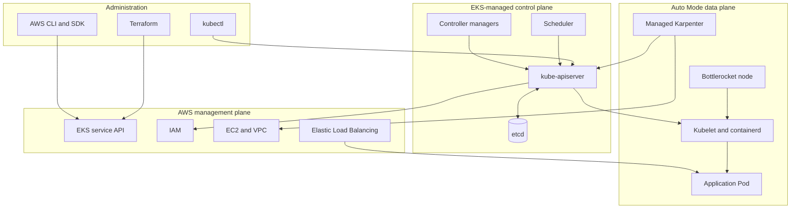
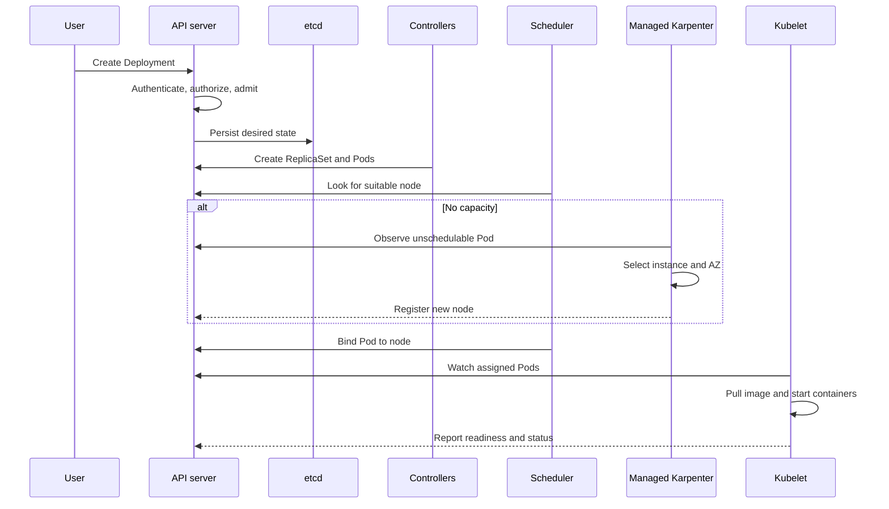

# 1. EKS architecture and reconciliation

## Three planes to understand

### AWS management plane

The AWS management plane includes the AWS Console, CLI, SDKs, IAM, CloudTrail, Terraform, and service APIs. `aws eks describe-cluster` asks the EKS service about an AWS resource; it does not list Kubernetes Pods.

### Kubernetes control plane

Amazon EKS manages a single-tenant Kubernetes control plane containing API servers, `etcd`, the scheduler, and controller managers. AWS runs redundant API servers across Availability Zones and exposes them through the EKS Kubernetes API endpoint.

### Kubernetes data plane

The data plane runs workloads. In this environment EKS Auto Mode manages Bottlerocket nodes, kubelet, containerd, core networking, DNS, Pod Identity integration, EBS attachment, node health, and Karpenter-based capacity provisioning.

## What happens after creating a Deployment

1. `kubectl` sends the object to the API server.
2. Authentication establishes the caller's identity.
3. Authorization decides whether that identity may create Deployments.
4. Admission validates and possibly mutates the object.
5. Desired state is persisted in `etcd`.
6. The Deployment controller creates a ReplicaSet.
7. The ReplicaSet creates Pod objects.
8. The scheduler selects compatible nodes.
9. If capacity is unavailable, managed Karpenter creates a NodeClaim and requests EC2 capacity.
10. Kubelet pulls images and starts containers through containerd.
11. Readiness probes decide whether Service traffic can reach each Pod.
12. Controllers continually compare desired and actual state and repair drift.

## Auto Mode objects

- **NodePool:** Kubernetes scheduling and lifecycle policy: capacity type, architecture, allowed instance categories, consolidation, expiration, taints, and disruption budgets.
- **NodeClass:** AWS-specific configuration: IAM node role, subnets, security groups, ephemeral storage, SNAT, and network-policy behavior.
- **NodeClaim:** A concrete capacity request created from a NodePool and NodeClass.
- **Node:** The registered Kubernetes representation of the resulting EC2 compute.

## Responsibility boundary

AWS manages the control-plane infrastructure and Auto Mode's integrated components. The customer remains responsible for workload manifests, images, IAM permissions, RBAC, data durability, network policy, application TLS, resource sizing, availability design, and cost controls.