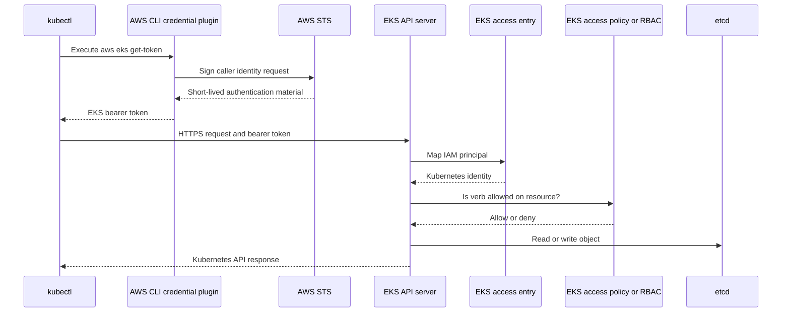

# 2. kubectl, authentication, and authorization

## What kubectl is

`kubectl` is an HTTP client for the Kubernetes API. It normally talks to the API server, not directly to EC2 nodes or containers.

Configure access without hardcoding environment values:

```bash
aws eks update-kubeconfig \
  --region "$AWS_REGION" \
  --name "$CLUSTER_NAME"
```

## Request flow



## Four independent gates

1. **Network reachability:** public/private API endpoint, route, DNS, and security controls.
2. **AWS credentials:** the local process must obtain valid AWS credentials.
3. **Authentication:** EKS must map the IAM principal through access entries or legacy mappings.
4. **Authorization:** an EKS access policy or Kubernetes RBAC must permit the action.

A failure at each layer looks different:

- Timeout/DNS error: endpoint reachability.
- Expired token or AWS credential error: local AWS authentication.
- `Unauthorized`: Kubernetes authentication failed.
- `Forbidden`: identity is authenticated but not authorized.

## RBAC model

RBAC uses:

- `Role`: namespaced permissions.
- `ClusterRole`: cluster-wide or reusable permissions.
- `RoleBinding`: binds a user/group/ServiceAccount to a Role or ClusterRole in one namespace.
- `ClusterRoleBinding`: binds cluster-wide.

Example read-only application role:

```yaml
apiVersion: rbac.authorization.k8s.io/v1
kind: Role
metadata:
  name: application-reader
  namespace: retail-store
rules:
  - apiGroups: [""]
    resources: ["pods", "services", "events"]
    verbs: ["get", "list", "watch"]
  - apiGroups: ["apps"]
    resources: ["deployments", "replicasets"]
    verbs: ["get", "list", "watch"]
```

## Safe discovery commands

```bash
kubectl version
kubectl auth whoami
kubectl auth can-i get pods -A
kubectl config current-context
kubectl api-resources
kubectl get namespaces
kubectl get nodes -o wide
kubectl get deployments,pods,services -A
```

Use these commands carefully because output can contain account-specific names and annotations. Do not commit raw output.

## Version skew

Keep `kubectl` within one minor version of the Kubernetes API server. A server on `1.34` should normally be managed using a `1.33`, `1.34`, or `1.35` client, with `1.34` preferred.