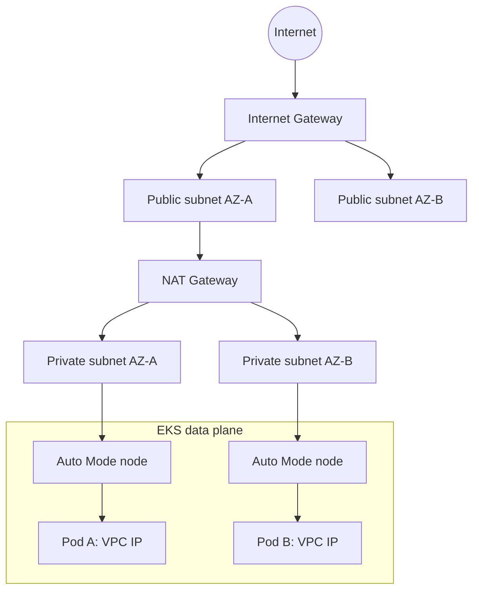
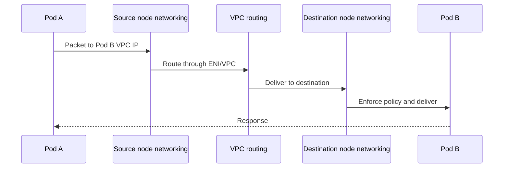

# 3. EKS networking

## Address spaces

An EKS IPv4 cluster commonly uses two address spaces:

- **VPC CIDR:** node ENIs and VPC-native Pod addresses.
- **Kubernetes Service CIDR:** virtual ClusterIP addresses.

Observed sanitized example:

```text
VPC:       10.0.0.0/16
Node:      10.0.x.x
Pods:      10.0.x.x
Services:  172.20.x.x from a 172.20.0.0/16 Service CIDR
```

Pod IPs are replaceable. Services provide stable discovery over changing Pod endpoints.

## VPC structure



A public subnet has a route to an Internet Gateway. A private subnet has no direct route to an Internet Gateway and normally uses a NAT Gateway for outbound IPv4 access.

## Pod-to-Pod



Auto Mode includes managed VPC networking. NetworkPolicy enforcement can be enabled and applied with standard Kubernetes `NetworkPolicy` resources.

## Pod-to-Service

1. Application resolves `service.namespace.svc.cluster.local`.
2. Cluster DNS returns the Service ClusterIP.
3. Node networking translates or balances the virtual address to a ready endpoint.
4. Traffic reaches a selected Pod IP and target port.

```text
ui.retail-store.svc.cluster.local
  → Service ClusterIP:80
  → ready EndpointSlice member
  → UI Pod VPC IP:8080
```

## Pod-to-internet

```text
Pod private IP
  → private route table
  → NAT Gateway
  → Internet Gateway
  → external service
```

The return path is associated with the NAT translation. NAT enables outbound connections; it does not expose the Pod for unsolicited inbound traffic.

## North-south traffic

External traffic normally enters through:

- ALB provisioned from an Ingress for HTTP/HTTPS.
- NLB provisioned from a `LoadBalancer` Service for TCP/UDP.

With IP targets, an AWS target group can send traffic directly to Pod VPC addresses.

## Security checkpoints

A packet may be controlled by:

1. DNS resolution
2. route tables
3. network ACLs
4. load-balancer listeners and target groups
5. security groups
6. Kubernetes NetworkPolicies
7. Service selectors and EndpointSlices
8. Pod readiness
9. container listener port
10. application authorization

## Subnet discovery tags

EKS Auto Mode load balancing requires discoverable subnets:

```text
Public/internet-facing: kubernetes.io/role/elb = 1
Private/internal:       kubernetes.io/role/internal-elb = 1
```

ALBs require suitable subnets in at least two Availability Zones. Multi-AZ nodes and topology spread should also be used for workload availability.