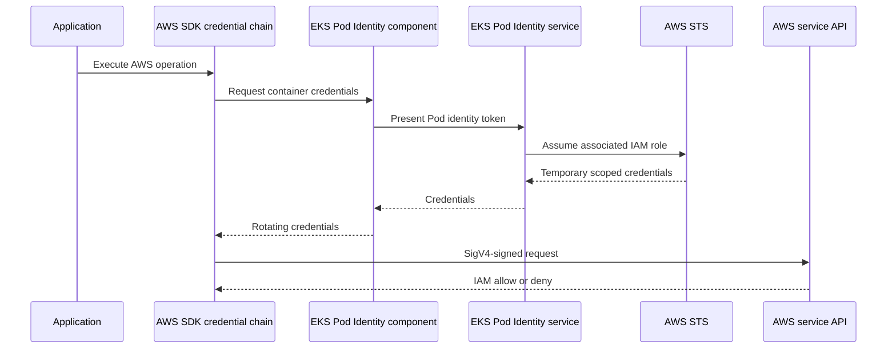

# 4. EKS Pod Identity

## Problem Pod Identity solves

Applications need AWS credentials for APIs such as DynamoDB, S3, SQS, KMS, Secrets Manager, and AMP. Credentials must be temporary, automatically rotated, and isolated by workload. Giving application permissions to the EC2 node role violates least privilege because unrelated Pods share the node.

## Identity boundary

An EKS Pod Identity association connects:

```text
EKS cluster + Kubernetes namespace + ServiceAccount → IAM role
```

The Pod must set `spec.serviceAccountName` to the associated ServiceAccount. Unlike IRSA, EKS Pod Identity does not require an IAM role ARN annotation on that ServiceAccount.

## Credential flow



The IAM role trust relationship permits the EKS Pods service:

```json
{
  "Effect": "Allow",
  "Principal": {
    "Service": "pods.eks.amazonaws.com"
  },
  "Action": [
    "sts:AssumeRole",
    "sts:TagSession"
  ]
}
```

## Sanitized real example

The inspected cluster associates the `retail-store/carts` ServiceAccount with an application IAM role. That role can perform only required DynamoDB item/query operations against the carts table and its indexes. It has no wildcard resource and no unrelated AWS service permissions.

```text
Carts Pod
  → serviceAccountName: carts
  → EKS Pod Identity association
  → carts-specific IAM role
  → carts DynamoDB table only
```

## Pod Identity versus other methods

| Method | Scope | Guidance |
|---|---|---|
| Node role | Shared by node-level infrastructure | Do not place normal application permissions here |
| IRSA | OIDC trust mapped to a ServiceAccount | Valid for existing EKS designs |
| EKS Pod Identity | EKS-managed association to ServiceAccount | Preferred simplified EKS workload identity |
| Static keys | Long-lived credentials | Avoid |

## Important distinction

Pod Identity controls AWS API access. Kubernetes RBAC controls Kubernetes API access. A workload may have DynamoDB permissions but no ability to list Pods, or vice versa.

## Validation approach

Use application behavior or non-secret identity checks. Never print environment variables, container credential endpoints, tokens, or temporary credentials into logs. Validate the role policy from IAM and inspect the EKS Pod Identity association instead.