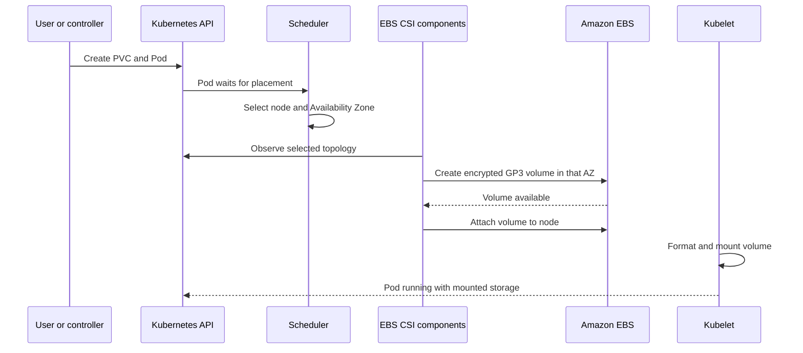

# 5. Kubernetes storage and Amazon EBS

## Storage layers

| Layer | Lifetime | Typical use |
|---|---|---|
| Container writable layer | Container lifetime | Temporary files only |
| `emptyDir` | Pod lifetime | Cache or shared Pod scratch space |
| PersistentVolumeClaim | Independent persistent lifecycle | Application data |
| External data service | Service-defined | DynamoDB, RDS, S3, etc. |

A StatefulSet does not automatically make data persistent. Persistence requires `volumeClaimTemplates` or an existing PVC.

## Kubernetes objects

- **StorageClass:** dynamic provisioning policy.
- **PersistentVolumeClaim (PVC):** workload request for capacity and access mode.
- **PersistentVolume (PV):** Kubernetes representation of provisioned storage.
- **CSI driver:** implements create, attach, mount, expand, and delete operations.

## EBS dynamic provisioning flow



`WaitForFirstConsumer` delays volume creation until scheduling determines the correct Availability Zone. This avoids creating an EBS volume in an AZ where the Pod cannot run.

## Auto Mode StorageClass example

```yaml
apiVersion: storage.k8s.io/v1
kind: StorageClass
metadata:
  name: auto-ebs-sc
  annotations:
    storageclass.kubernetes.io/is-default-class: "true"
provisioner: ebs.csi.eks.amazonaws.com
volumeBindingMode: WaitForFirstConsumer
allowVolumeExpansion: true
reclaimPolicy: Delete
parameters:
  type: gp3
  encrypted: "true"
```

## PVC example

```yaml
apiVersion: v1
kind: PersistentVolumeClaim
metadata:
  name: application-data
  namespace: retail-store
spec:
  accessModes:
    - ReadWriteOnce
  storageClassName: auto-ebs-sc
  resources:
    requests:
      storage: 20Gi
```

## Reclaim policy warning

`reclaimPolicy: Delete` usually deletes the underlying EBS volume when its PV is released. For important databases, determine backup, snapshot, retention, and recovery requirements before choosing a policy.

## Storage choice

- EBS: low-latency block storage, normally `ReadWriteOnce`, AZ-scoped.
- EFS: shared `ReadWriteMany` filesystem across AZs.
- FSx: specialized high-performance filesystems.
- S3: object storage accessed through an SDK/API rather than assumed to be a normal POSIX disk.
- DynamoDB/RDS: managed data services that move durability outside the Pod lifecycle.

## Sanitized live observation

The inspected cluster has an encrypted GP3 Auto Mode StorageClass but no PVCs or PVs. A sample MySQL StatefulSet uses `emptyDir`, so its data can be lost when the Pod is removed or rescheduled. A sensitive database value was also present directly in the workload specification and should be moved to a Secret-management solution.