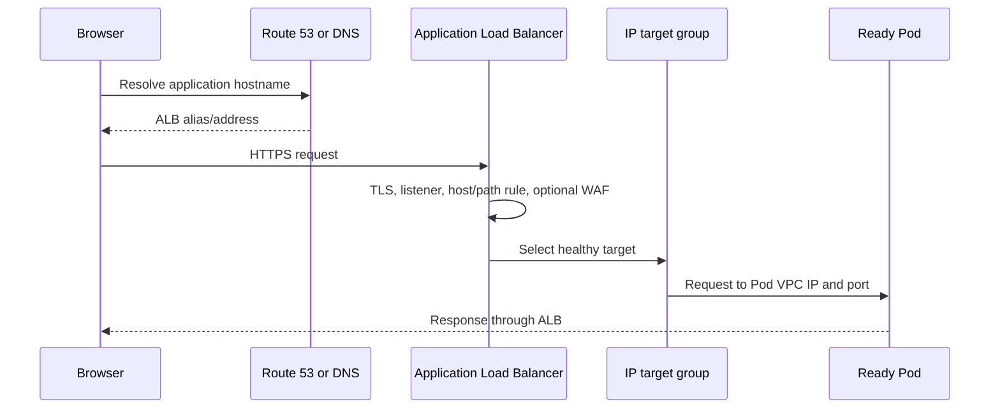
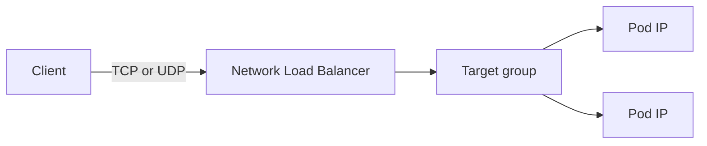

# 6. Exposing applications with ALB and NLB

## Decision table

| Requirement | ALB | NLB |
|---|---|---|
| Network layer | L7 | L4 |
| HTTP/HTTPS | Yes | Can pass TCP/TLS but no HTTP routing |
| Host/path routing | Yes | No |
| TCP/UDP services | No | Yes |
| AWS WAF integration | Yes | Not equivalent to ALB |
| Kubernetes resource | Ingress | Service type `LoadBalancer` |
| Auto Mode class/controller | `eks.amazonaws.com/alb` | `eks.amazonaws.com/nlb` |

Classic Load Balancers are legacy and generally should not be chosen for new EKS designs.

## ALB flow



Ingress example:

```yaml
apiVersion: networking.k8s.io/v1
kind: Ingress
metadata:
  name: ui
  namespace: retail-store
  annotations:
    alb.ingress.kubernetes.io/scheme: internet-facing
    alb.ingress.kubernetes.io/target-type: ip
spec:
  ingressClassName: alb
  rules:
    - http:
        paths:
          - path: /
            pathType: Prefix
            backend:
              service:
                name: ui
                port:
                  number: 80
```

The Auto Mode IngressClass controller is `eks.amazonaws.com/alb`. No separately managed load-balancer-controller Deployment is required.

## NLB flow



Service example:

```yaml
apiVersion: v1
kind: Service
metadata:
  name: application-nlb
  namespace: retail-store
  annotations:
    service.beta.kubernetes.io/aws-load-balancer-scheme: internet-facing
spec:
  type: LoadBalancer
  loadBalancerClass: eks.amazonaws.com/nlb
  selector:
    app.kubernetes.io/name: ui
  ports:
    - port: 80
      targetPort: 8080
```

Use an internal scheme for private applications.

## ALB prerequisites

An internet-facing ALB needs:

- public subnets in at least two Availability Zones
- an Internet Gateway route
- subnet tag `kubernetes.io/role/elb=1`
- suitable free addresses
- EKS load-balancing capability and IAM permissions
- an IngressClass whose controller is `eks.amazonaws.com/alb`
- a backend Service with ready endpoints

An internal ALB uses private subnets tagged `kubernetes.io/role/internal-elb=1`.

## TLS production path

1. Register or delegate DNS.
2. Request/validate an ACM certificate.
3. Configure the ALB HTTPS listener/certificate.
4. Redirect HTTP to HTTPS.
5. Restrict inbound CIDRs when possible.
6. Add WAF for public HTTP applications when appropriate.
7. Configure application-aware health checks.
8. Monitor ALB, target response time, HTTP status, and target health.

## Provisioning validation

```bash
kubectl get ingress -n retail-store
kubectl get events -n retail-store \
  --field-selector involvedObject.kind=Ingress,involvedObject.name=ui
kubectl get service ui -n retail-store
kubectl get endpointslice -n retail-store \
  -l kubernetes.io/service-name=ui
```

After an AWS load balancer becomes active, wait at least 150 seconds before connectivity testing because target registration and DNS propagation can lag behind the AWS state.