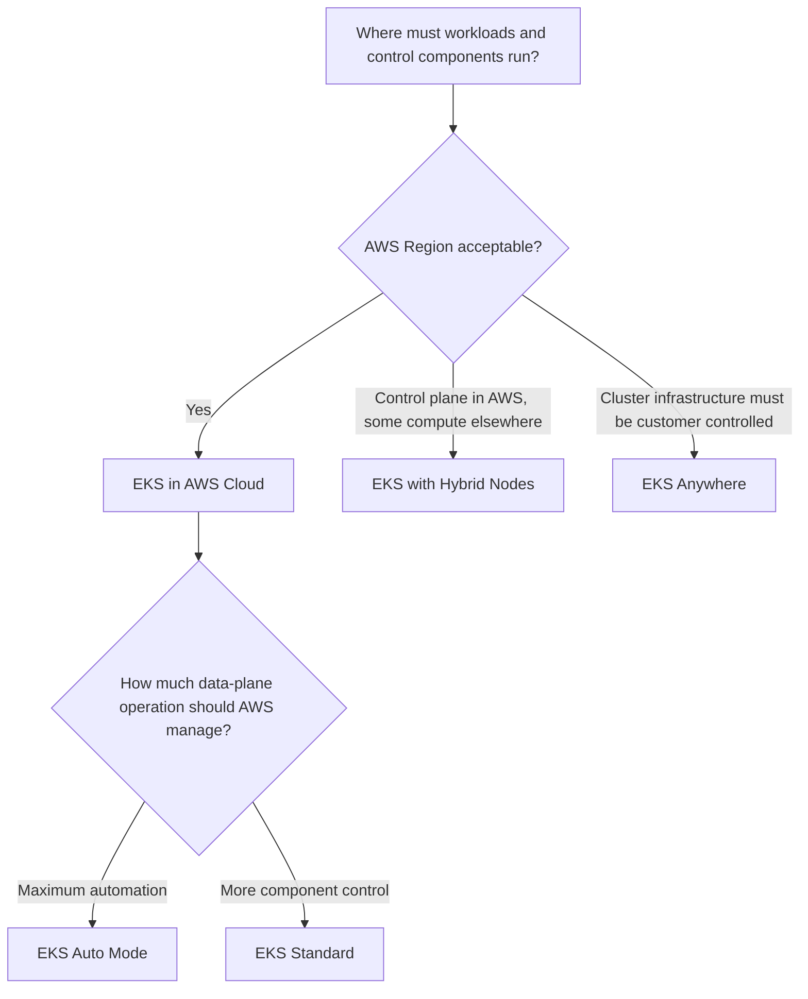
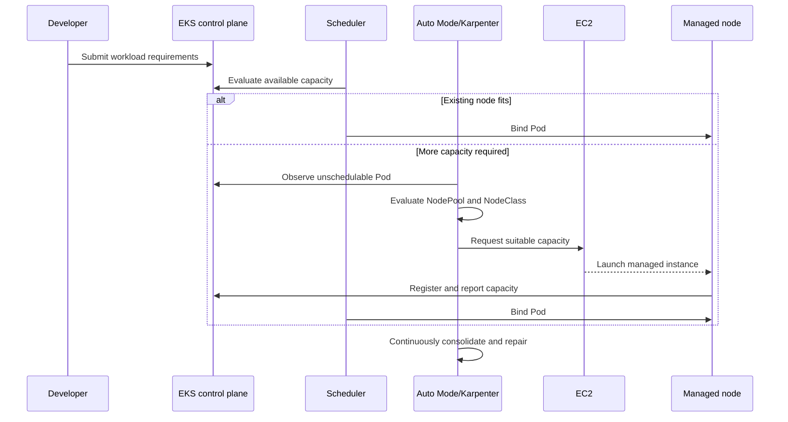
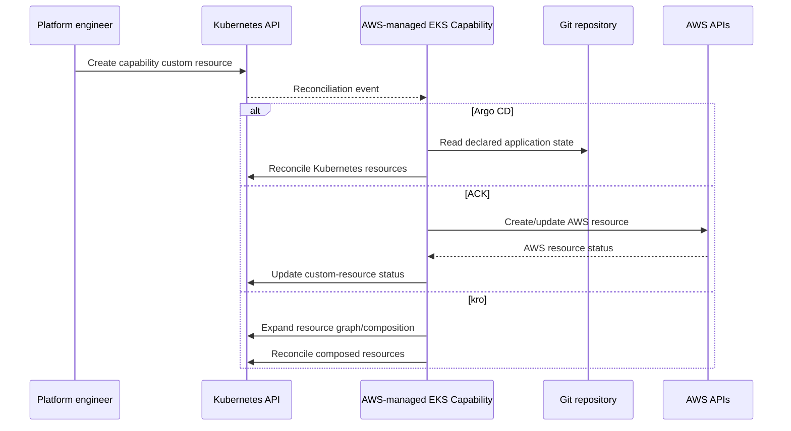
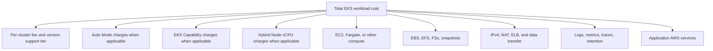
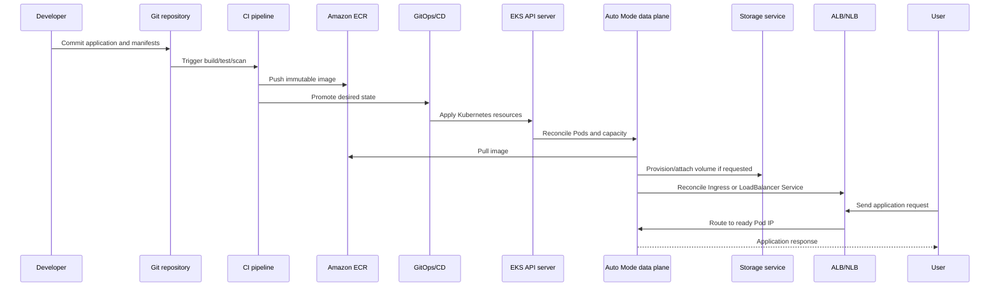

# 9. What is Amazon EKS? — complete explained guide

**Primary source:** [AWS: What is Amazon EKS?](https://docs.aws.amazon.com/eks/latest/userguide/what-is-eks.html)  
**Source retrieved:** 2026-09-23 UTC  
**Coverage:** Every substantive section of the source page, explained and expanded in original language. Linked AWS subpages are references for further study and are not reproduced.

## 1. One-sentence definition

Amazon Elastic Kubernetes Service (Amazon EKS) is AWS's managed Kubernetes platform. It provides a Kubernetes-conformant control plane and offers several ways to run the compute, networking, storage, identity, and platform services needed by containerized applications.

The crucial word is **managed**. Kubernetes remains the orchestration API and operating model, while AWS takes responsibility for selected infrastructure and operational tasks.

## 2. What problem EKS solves

A production Kubernetes platform needs much more than starting containers:

- highly available API servers and `etcd`
- secure identity and authorization
- upgrades and security patching
- compute provisioning and replacement
- Pod and Service networking
- DNS
- persistent storage integration
- load balancers and ingress
- observability, audit, and threat detection
- workload scaling and failure recovery

Building all of this yourself requires substantial platform engineering. EKS reduces that burden, allowing teams to deploy sooner, scale as demand changes, integrate with AWS security services, and use automated or managed updates.

```mermaid
flowchart LR
    Team[Application and platform teams] --> API[Kubernetes APIs]
    API --> EKS[Amazon EKS managed platform]
    EKS --> CP[Highly available control plane]
    EKS --> Compute[Compute choices]
    EKS --> Network[VPC networking and ELB]
    EKS --> Identity[IAM and Pod Identity]
    EKS --> Storage[CSI and AWS storage]
    EKS --> Observe[CloudWatch, Prometheus, CloudTrail]
    CP --> Workloads[Running workloads]
    Compute --> Workloads
    Network --> Workloads
    Identity --> Workloads
    Storage --> Workloads
```



## 3. Where EKS can run Kubernetes workloads

The overview identifies three broad deployment patterns.

### 3.1 EKS in the AWS Cloud

The control plane is managed by EKS. The workload data plane can use Auto Mode or customer-selected compute options. AWS services such as EC2, EBS, ECR, ELB, CloudWatch, and GuardDuty integrate around the cluster.

### 3.2 Amazon EKS Hybrid Nodes

Hybrid Nodes connect supported on-premises or edge compute into an EKS cluster. The EKS control plane remains an AWS service while registered hybrid nodes run workloads outside normal AWS EC2 data-plane placement. This introduces networking, latency, connectivity, capacity, and lifecycle considerations that differ from normal in-Region nodes.

### 3.3 EKS Anywhere

EKS Anywhere supports operating Kubernetes in customer-controlled environments using AWS-supported Kubernetes tooling and patterns. It is relevant when the cluster infrastructure itself must run outside the AWS Cloud. Its operational and responsibility model is different from using an AWS-hosted EKS control plane with Hybrid Nodes.

### Placement decision



The choice is architectural, not merely a deployment flag. It affects network dependencies, operational ownership, upgrades, failure domains, and cost.

## 4. EKS Standard versus EKS Auto Mode

## 4.1 EKS Standard

In a standard EKS cluster, AWS manages the Kubernetes control plane. Customers retain more decisions and operational responsibility for the data plane and cluster components.

Typical responsibilities include:

- selecting managed node groups, self-managed nodes, Fargate, or Karpenter
- choosing instance types and capacity models
- maintaining node images and replacement strategies
- installing/configuring supported networking, storage, DNS, ingress, and policy components as applicable
- coordinating add-on and node compatibility with Kubernetes upgrades
- designing scaling, disruption, and cost controls

“Standard” does not mean unmanaged. For example, EKS managed node groups can automate EC2 group lifecycle, and EKS add-ons can manage supported component installation. It means the customer composes and controls more of the platform.

## 4.2 EKS Auto Mode

Auto Mode extends AWS management into the Kubernetes data plane. It integrates managed capabilities for:

- compute provisioning
- instance selection
- dynamic scaling and consolidation
- operating-system patching and node replacement
- VPC-native Pod networking and network-policy enforcement
- node-local DNS and network proxying
- EBS block-storage integration
- Pod Identity delivery
- ALB and NLB lifecycle integration
- node health monitoring and repair

Applications still specify Kubernetes requirements such as resource requests, architecture constraints, topology, volumes, and Services. Auto Mode uses those requirements to make infrastructure decisions.

## 4.3 Responsibility comparison

| Concern | EKS Standard | EKS Auto Mode |
|---|---|---|
| Kubernetes control plane | AWS | AWS |
| API server and `etcd` availability | AWS | AWS |
| Compute composition | Customer selects/configures options | AWS-integrated NodePools and NodeClasses |
| Instance selection | Customer rules/tools | Auto Mode selects from allowed requirements |
| Node OS lifecycle | Customer/managed-node-group process | Auto Mode managed replacement/patching |
| VPC CNI, DNS, proxy | Add-ons/components managed by customer/AWS add-ons | Integrated managed capability |
| EBS CSI | Customer enables/manages add-on | Integrated capability |
| ALB/NLB controller lifecycle | Customer-managed or EKS add-on pattern | Integrated capability |
| Workload manifests and images | Customer | Customer |
| RBAC and IAM design | Customer | Customer |
| Data durability and backups | Customer | Customer |
| Application security | Customer | Customer |

## 4.4 Auto Mode provisioning flow



Auto Mode reduces platform toil, but teams still need good resource requests. Missing or unrealistic requests lead to poor scheduling, scaling, performance, and cost behavior.

## 5. EKS Capabilities

The source page distinguishes cluster infrastructure from **EKS Capabilities**. Capabilities are managed services that extend what teams can build through Kubernetes-native APIs while AWS operates core controllers and supporting components.

A useful mental model is:

```text
Kubernetes API definitions visible in the cluster
              ↓
Developers create Kubernetes custom resources
              ↓
AWS-managed capability controllers reconcile them
              ↓
Workloads, AWS resources, or composed platform APIs change
```



## 5.1 Argo CD capability

Argo CD implements declarative GitOps delivery:

1. desired application state is stored in Git
2. Argo CD compares Git with the live cluster
3. differences are reported or synchronized
4. health and synchronization state are tracked

This improves repeatability and auditability. GitOps does not automatically make every change safe; pull-request review, policy checks, secret handling, promotion, rollback, and environment separation still matter.

## 5.2 AWS Controllers for Kubernetes (ACK)

ACK exposes selected AWS resources through Kubernetes custom resources. A team can describe an AWS resource in Kubernetes-style YAML, and a controller reconciles it through AWS APIs.

Use cases include application-owned cloud resources and Kubernetes-native workflows. Governance remains essential because creating a Kubernetes custom resource can create a billable or publicly reachable AWS resource. IAM boundaries, admission policy, tagging, deletion policy, and Infrastructure-as-Code ownership must be explicit.

## 5.3 kro — Kube Resource Orchestrator

kro helps platform teams define higher-level APIs composed from lower-level Kubernetes resources. For example, a company-specific `WebApplication` resource might expand into a Deployment, Service, autoscaler, policy, and observability objects.

The benefit is abstraction and standardization. The risk is hiding important behavior, so platform APIs need clear schemas, defaults, ownership, versioning, status, and failure messages.

## 5.4 Capabilities versus add-ons

- **Add-ons** commonly provide cluster infrastructure functions such as networking, DNS, storage, or observability agents.
- **Capabilities** expose higher-level managed platform functions, with Kubernetes APIs in the cluster while controllers/supporting infrastructure are managed by EKS.

The exact ownership and lifecycle should always be verified for the selected capability.

## 6. Amazon EKS feature map

## 6.1 Management interfaces

EKS can be managed through:

- AWS Management Console
- EKS API and AWS SDKs
- AWS CLI
- `eksctl`
- AWS CDK
- AWS CloudFormation
- Terraform

These tools overlap but serve different workflows:

| Interface | Best fit |
|---|---|
| Console | Exploration and occasional inspection |
| AWS CLI/SDK | Automation and precise service API calls |
| `eksctl` | EKS-focused cluster workflows |
| CDK/CloudFormation | AWS-native Infrastructure as Code |
| Terraform | Declarative multi-service/multi-provider IaC |
| `kubectl` | Kubernetes API objects after cluster access exists |

Do not split ownership casually. If Terraform creates a VPC or EKS setting, avoid making persistent console changes that Terraform will later revert or interpret as drift.

## 6.2 Access control tools

EKS combines AWS IAM and Kubernetes authorization.

### Human/automation access to Kubernetes

```text
AWS credentials
  → EKS token
  → EKS access entry or identity mapping
  → EKS access policy and/or Kubernetes RBAC
  → Kubernetes API operation
```

### Workload access to AWS

```text
Pod uses ServiceAccount
  → EKS Pod Identity or IRSA mapping
  → temporary IAM role credentials
  → AWS API authorization
```

These are separate. Kubernetes RBAC does not grant DynamoDB access, and IAM permission to S3 does not automatically permit listing Kubernetes Secrets.

## 6.3 Compute resources

EKS supports the broad EC2 portfolio, including:

- general-purpose, compute-optimized, and memory-optimized families
- AWS Graviton/Arm instances
- GPU and accelerated computing
- Nitro-based capabilities
- On-Demand and Spot purchasing models

Workload requirements should drive selection:

```text
CPU/memory/GPU requirement
  + architecture and OS
  + latency and network requirement
  + interruption tolerance
  + availability zones
  + price/capacity availability
  → scheduling constraints and compute policy
```

Do not select instances only by average CPU. Consider memory, ephemeral storage, network bandwidth, EBS throughput, startup latency, Pod density, daemon overhead, and failure-domain distribution.

## 6.4 Storage

The overview highlights EBS integration in Auto Mode and CSI-based access to AWS storage options.

| Storage | Model | Typical Kubernetes need |
|---|---|---|
| EBS | AZ-scoped block volume | Stateful single-writer workloads |
| EFS | Regional shared filesystem | Multiple Pods requiring ReadWriteMany |
| FSx | Managed specialized filesystem | High-performance or workload-specific filesystems |
| S3/S3 file-oriented integrations | Object/file access patterns | Large-scale object data or supported file semantics |
| File Cache | High-speed cache for file datasets | Data-intensive workloads |

Storage selection must include durability, access mode, performance, backup, encryption, reclaim behavior, and disaster recovery—not only capacity.

## 6.5 Security and shared responsibility

AWS secures the managed EKS service infrastructure. Customers secure their configuration and workloads.

### AWS responsibilities include

- physical facilities and foundational infrastructure
- EKS control-plane service infrastructure
- managed-service patching and availability within the service boundary
- Auto Mode-managed components within their documented boundary

### Customer responsibilities include

- IAM and Kubernetes RBAC
- endpoint access and VPC design
- workload images and software vulnerabilities
- Pod security settings
- NetworkPolicies and traffic exposure
- Secrets and KMS policy
- data classification, retention, and backup
- logging, detection, alerting, and incident response
- Kubernetes version and workload compatibility planning

Managed does not mean automatically secure. It means the ownership boundary changes.

## 6.6 Monitoring tools

The source identifies the EKS observability dashboard and integrations including Prometheus, CloudWatch, CloudTrail, and ADOT.

Use the signals for different questions:

| Signal/tool | Question answered |
|---|---|
| Kubernetes status/events | Is desired state being reconciled? |
| Application logs | What did the application do? |
| CloudWatch metrics/logs | Are cluster and AWS resources healthy? |
| Prometheus/AMP | What are workload and platform time-series trends? |
| ADOT/OpenTelemetry | How are metrics, traces, and logs collected/exported? |
| CloudTrail | Which identity called an AWS API and when? |
| EKS audit log | Which identity performed a Kubernetes API action? |

A complete incident timeline often correlates several of these rather than relying on one dashboard.

## 6.7 Cluster capabilities

EKS Capabilities support continuous deployment, AWS resource management, and resource composition. Kubernetes APIs are made available to the cluster, while controllers and supporting services operate under EKS management with automated patching, scaling, and monitoring.

Platform teams should still define:

- who may create capability resources
- what IAM permissions those resources can exercise
- policy/admission controls
- namespaces and tenancy boundaries
- lifecycle and deletion ownership
- audit and cost attribution

## 6.8 Kubernetes compatibility and support

EKS is Kubernetes-conformant. Standard Kubernetes APIs and compatible tools can generally be used without application refactoring.

Conformance does not guarantee that every plugin supports every EKS/Kubernetes version. Validate:

- API removals and deprecations
- admission webhooks
- CSI/CNI integrations
- CRDs and controllers
- Helm charts
- node OS/runtime compatibility
- observability and security agents

EKS provides standard support and extended support phases. Remaining on an older extended-support version can increase cluster cost and should be treated as a temporary risk-management option, not an alternative to upgrade planning.

## 7. Related AWS services

## 7.1 Amazon EC2

Provides scalable compute capacity for nodes. Instance family, purchase model, architecture, and availability directly influence Pod scheduling, reliability, and cost.

## 7.2 Amazon EBS

Provides persistent block volumes. EBS volumes live in one AZ, so scheduling topology and recovery design are critical.

## 7.3 Amazon ECR

Stores container images. A typical deployment flow is:

```text
Build image → scan → push immutable digest to ECR
  → Deployment references image digest
  → node authenticates and pulls image
  → containerd starts container
```

Use immutable tags/digests, vulnerability scanning, lifecycle policies, and least-privilege pull permissions.

## 7.4 Amazon CloudWatch

Collects AWS and cluster logs, metrics, alarms, and dashboards. It is commonly used for EKS control-plane logs, Container Insights, application logs, and alarm-driven operations.

## 7.5 Amazon Managed Service for Prometheus

Provides managed Prometheus-compatible metric storage and querying. Collectors such as ADOT can scrape workloads and remote-write metrics to the workspace.

## 7.6 Elastic Load Balancing

ALBs route HTTP/HTTPS based on hosts and paths. NLBs handle high-performance TCP/UDP and network-level use cases. EKS Auto Mode can manage their lifecycle from Kubernetes Ingress and Service objects.

## 7.7 Amazon GuardDuty

Provides managed threat detection. EKS-related detections can contribute to identifying suspicious control-plane or runtime behavior, depending on enabled protection plans and supported telemetry.

## 7.8 AWS Resilience Hub

Helps assess resilience posture against defined recovery objectives. It complements—but does not replace—multi-AZ architecture, backups, restore exercises, disruption testing, and application-level resilience.

## 8. Pricing model

EKS cost is a stack, not one number.



## 8.1 Cluster charge and version support

EKS charges per cluster. The rate depends partly on whether the Kubernetes version is in standard or extended support. Upgrade timing therefore affects both risk and cost.

## 8.2 Auto Mode

Auto Mode has its own pricing in addition to underlying AWS resources. The operational savings should be evaluated against charges and the engineering effort avoided.

## 8.3 Hybrid Nodes

Hybrid Nodes use a per-vCPU pricing dimension. Connectivity and on-premises infrastructure costs remain separate.

## 8.4 Workload AWS resources

Customers separately pay for resources consumed by workloads, for example:

- EC2 instance capacity
- EBS volumes and snapshots
- public IPv4 addresses
- load balancers and processed data
- NAT Gateway hours and bytes
- logging and metric ingestion/retention
- ECR storage and transfer
- managed databases and messaging services

Savings Plans can apply to eligible compute usage. Spot can reduce compute cost for interruption-tolerant workloads but requires graceful disruption handling.

## 8.5 Control-plane/data-plane transfer

The EKS control plane communicates with worker nodes through requester-managed network interfaces in the customer VPC. Standard transfer rates can apply on the customer side for traffic entering nodes from the control plane and leaving nodes toward the control plane. EKS absorbs the corresponding control-plane-side transfer cost described by AWS.

This is usually not the largest line item, but topology, cross-AZ traffic, log volume, image pulls, NAT paths, and load-balancer processing can become material at scale.

## 8.6 Cost-allocation questions

For every cluster ask:

1. Is the cluster itself necessary, or can environments share safely?
2. Is the Kubernetes version in standard support?
3. Are requests causing oversized nodes?
4. Can unused nodes consolidate?
5. Is Spot safe for any workload tier?
6. Are EBS volumes, snapshots, and load balancers orphaned?
7. Is cross-AZ/NAT traffic avoidable without reducing resilience?
8. Are log and metric retention periods intentional?
9. Are public IPv4 addresses required?
10. Are costs tagged and attributable to team/application/environment?

## 9. Complete application lifecycle on EKS



At each arrow, identity, authorization, networking, encryption, observability, retries, failure handling, and cost must be considered.

## 10. Mapping the overview to the inspected workshop cluster

| AWS overview concept | Sanitized observed implementation |
|---|---|
| Managed Kubernetes control plane | Active EKS 1.34 control plane |
| Auto Mode | Integrated compute, networking, storage, identity, and ELB capability enabled |
| EC2 compute | One Auto Mode Bottlerocket node |
| IAM access | EKS access entries and Kubernetes authorization |
| Workload identity | Pod Identity associations, including carts-to-DynamoDB |
| Storage | Encrypted GP3 Auto Mode StorageClass |
| Monitoring | ADOT, managed Prometheus workspace, Grafana, CloudWatch integration |
| ELB integration | Auto Mode ALB IngressClass configured |
| Shared responsibility | Current public endpoint, ephemeral database data, and single-node placement remain customer design concerns |

## 11. Final mental model

Amazon EKS is not “Kubernetes without operations.” It is Kubernetes with a configurable transfer of operational responsibility to AWS.

Use this decision sequence:

```text
Where must the cluster/workloads run?
  → How much platform control versus automation is required?
  → Standard, Auto Mode, Hybrid Nodes, or EKS Anywhere
  → What compute, storage, and network behavior do workloads need?
  → How will humans and Pods receive identity?
  → How will traffic enter and leave?
  → How will state survive failures?
  → How will security, observability, upgrades, and cost be governed?
```

The strongest EKS designs make every ownership boundary explicit: AWS service responsibility, platform-team responsibility, application-team responsibility, and security/operations responsibility.