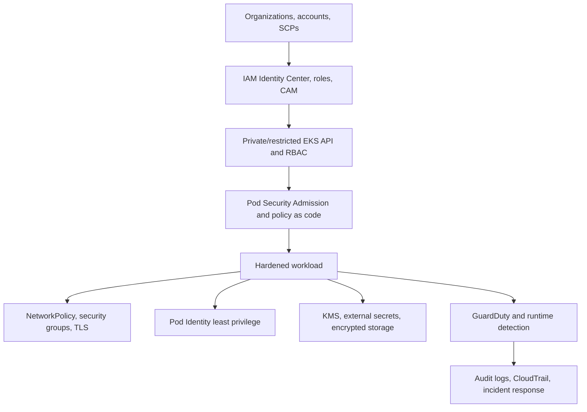
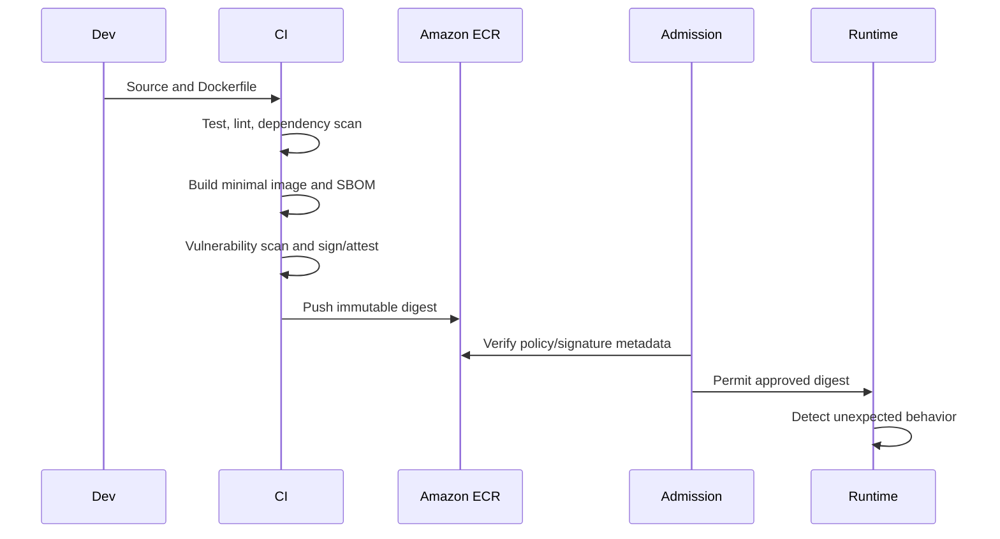

# 10. Production security and governance

**Primary comparison source:** [AWS EKS Best Practices — Security](https://docs.aws.amazon.com/eks/latest/best-practices/security.html)

Security in EKS is layered. No single control—private subnets, IAM, RBAC, NetworkPolicy, image scanning, or runtime detection—is sufficient by itself.

## 1. Defense-in-depth model



A control should either prevent, detect, limit, or help recover from failure or compromise. Strong designs use several independent layers.

## 2. Cluster access management

### Recommended human access flow

```text
Corporate identity provider
  → AWS IAM Identity Center
  → short-lived assumed IAM role
  → EKS Cluster Access Management access entry
  → EKS access policy and/or Kubernetes RBAC
  → Kubernetes API
```

Best practices:

- Prefer federated, short-lived roles over IAM users and access keys.
- Use EKS access entries/Cluster Access Management rather than building new dependencies on the legacy `aws-auth` ConfigMap.
- Give roles to teams; do not maintain separate handcrafted permissions for every person.
- Separate platform administration, security audit, application deployment, and read-only support roles.
- Remove permanent cluster-admin access from the cluster creator after bootstrap.
- Avoid ServiceAccount tokens for human or CI authentication when IAM federation is available.
- Review access entries, access policies, RoleBindings, and ClusterRoleBindings regularly.
- Use `kubectl auth can-i` and impersonation-aware tests to verify least privilege.
- Record both EKS audit logs and CloudTrail so Kubernetes and AWS activity can be correlated.

### Endpoint protection

Prefer a private Kubernetes API endpoint when operator and automation networks can reach it. If public access is required:

- enable private access as well
- restrict public CIDRs to trusted egress addresses
- avoid `0.0.0.0/0`
- monitor authentication failures and unusual source networks
- protect administration paths with VPN, Direct Connect, or controlled access hosts

A private endpoint reduces network exposure but does not replace IAM and RBAC.

## 3. Workload IAM

- Use EKS Pod Identity or IRSA for application-specific AWS permissions.
- Never solve an application permission problem by widening the node IAM role.
- Scope actions and resources; add IAM conditions where practical.
- Separate roles by workload trust boundary, not only by namespace convenience.
- Ensure Pod Identity roles trust `pods.eks.amazonaws.com` and no unrelated principal.
- Keep CNI, storage, observability, and application permissions separate.
- Monitor CloudTrail for unexpected role use.

## 4. Kubernetes RBAC

RBAC should be narrow in four dimensions:

1. API group
2. resource/subresource
3. verb
4. namespace or named resource

Avoid broad rules such as:

```yaml
apiGroups: ["*"]
resources: ["*"]
verbs: ["*"]
```

Pay special attention to permissions that indirectly escalate privileges:

- creating or patching Pods that use privileged settings
- reading Secrets
- creating RoleBindings/ClusterRoleBindings
- impersonating users or groups
- creating admission webhooks
- modifying validating policy
- using `pods/exec`, `pods/attach`, or `pods/portforward`
- creating workloads with powerful ServiceAccounts

Namespaces provide administrative scoping but are not a strong isolation boundary against a hostile cluster administrator.

## 5. Pod security

Use Pod Security Standards and Pod Security Admission as a baseline. Policy engines such as Kyverno or Gatekeeper can enforce organization-specific controls.

A hardened container commonly includes:

```yaml
securityContext:
  allowPrivilegeEscalation: false
  readOnlyRootFilesystem: true
  runAsNonRoot: true
  capabilities:
    drop:
      - ALL
  seccompProfile:
    type: RuntimeDefault
```

At Pod level, consider:

```yaml
securityContext:
  runAsNonRoot: true
  seccompProfile:
    type: RuntimeDefault
```

Also:

- prohibit privileged containers unless explicitly justified
- prohibit host PID, IPC, and network namespaces for normal applications
- restrict `hostPath` volumes
- restrict host ports
- use non-root images
- assign only necessary Linux capabilities
- avoid mounting ServiceAccount tokens when the workload does not use the Kubernetes API
- set CPU/memory requests and limits to reduce noisy-neighbor and denial-of-service risk

## 6. Policy as code and shift-left controls

Use the same rules in CI and admission where possible:

```text
Developer manifest
  → schema validation
  → policy-as-code tests
  → image signature/SBOM checks
  → pull-request review
  → admission policy
  → runtime monitoring
```

Policies should have:

- documented purpose and threat
- tests for allowed and denied cases
- audit mode before enforcement
- explicit exemptions with owners and expiration
- metrics and alerts for violations
- version control and staged rollout

Do not copy example policies into production without testing API versions and compatibility.

## 7. Network security

Start from default deny, then permit required flows.

Recommended sequence:

1. inventory application communication
2. apply default-deny ingress and egress per namespace
3. allow DNS to the correct resolver path
4. allow explicit namespace/Pod/port flows
5. allow required AWS/external destinations
6. observe denied traffic
7. continuously test service paths

NetworkPolicy and security groups operate at different layers:

- NetworkPolicy is Kubernetes-aware and well suited to Pod/namespace selectors.
- Security Groups for Pods integrate with VPC security boundaries and AWS resources.
- Security groups do not understand Kubernetes namespace intent.
- NetworkPolicy does not replace VPC routes, NACLs, or load-balancer controls.

Use TLS for sensitive east-west traffic. A service mesh can provide workload identity and mTLS but adds operational complexity and must be scaled and upgraded like any other critical platform component.

## 8. Secrets and data protection

- Enable KMS envelope encryption for Kubernetes Secrets.
- Restrict who can read Secrets and audit access.
- Prefer external secret providers for authoritative secret storage and rotation.
- Rotate credentials and encryption keys according to risk and compliance requirements.
- Avoid plaintext values in manifests, ConfigMaps, image layers, command arguments, and Git.
- Prefer mounted secret files over environment variables when the application supports secure reload; environment variables are commonly exposed in diagnostics and cannot rotate cleanly.
- Encrypt EBS, EFS, FSx, snapshots, logs, and backups.
- Control KMS key policies separately from IAM permissions.
- Test restore procedures; encryption without recoverable keys is data loss.

## 9. Image and software-supply-chain security



Recommendations:

- use minimal trusted base images and multi-stage builds
- pin dependencies and deploy immutable image digests
- generate an SBOM
- scan continuously, not only once during build
- define vulnerability response SLAs
- sign images and validate provenance/attestations
- run as non-root
- use private ECR endpoints and endpoint policies where appropriate
- restrict ECR repository IAM policies
- use lifecycle policies without deleting required rollback images
- maintain curated base images and rebuild them regularly

## 10. Node and host security

- Place nodes in private subnets.
- Prefer container-optimized, minimal operating systems such as Bottlerocket where suitable.
- Treat nodes as immutable and replace them rather than making undocumented manual changes.
- Keep node images patched.
- Minimize SSH/RDP; use controlled SSM access only when justified.
- Restrict instance metadata access and prevent workloads from obtaining node-role credentials.
- Use Amazon Inspector and node/runtime monitoring where supported.
- Validate applicable CIS benchmarks, but test hardening because not every generic control applies identically to managed EKS components.
- Limit privileged DaemonSets because they effectively extend trust to every node.

## 11. Multi-tenancy and multi-account design

### Soft multi-tenancy

Use namespaces, RBAC, quotas, NetworkPolicies, admission policies, priority classes, and workload IAM separation when tenants are cooperative and share an organizational trust boundary.

### Stronger isolation

Use separate clusters and often separate AWS accounts when tenants are mutually untrusted, have conflicting compliance boundaries, need independent blast radius, or require separate cluster administration.

```text
Higher trust and shared operations → namespace isolation may fit
Lower trust or regulated boundary → separate cluster/account is safer
```

Shared-cluster cost efficiency must be weighed against noisy neighbors, API contention, admission-controller blast radius, upgrade coordination, and administrator privilege.

## 12. Detective controls

Collect and correlate:

- EKS API/audit/authenticator logs
- CloudTrail management and data events where relevant
- GuardDuty findings
- VPC Flow Logs and network-policy logs
- application and container logs
- image vulnerability findings
- IAM Access Analyzer findings
- Kubernetes events

Alert on high-value behaviors, not every event. Examples include cluster access changes, creation of privileged workloads, Secret reads by unusual identities, disabled logging, public endpoint widening, unexpected exec sessions, and unusual Pod Identity role calls.

## 13. Incident response flow

```mermaid
flowchart LR
    Detect[Detect finding] --> Scope[Identify workload, Pod, node, identity, image]
    Scope --> Contain[Apply tested containment]
    Contain --> Preserve[Preserve volatile and audit evidence]
    Preserve --> Revoke[Revoke/limit credentials and access]
    Revoke --> Rebuild[Replace compromised workloads/nodes]
    Rebuild --> Recover[Validate clean service recovery]
    Recover --> Learn[Root cause and control improvements]
```



Containment may include a deny-all NetworkPolicy, workload scaling, credential revocation, node cordoning, or load-balancer rule changes. Actions can destroy evidence or availability, so use a rehearsed runbook and security approval process.

Do not “clean” compromised containers in place. Rebuild from trusted sources and replace them.

## 14. Governance with AWS Organizations and Service Control Policies (SCPs)

Service Control Policies can protect high-value EKS actions across accounts, but they do not grant permissions. Use them to establish organizational guardrails, such as restricting cluster deletion or configuration changes except through approved roles and tags.

If an SCP trusts a resource tag, protect who can create or modify that tag. Otherwise the guardrail can be bypassed.

## 15. Production checklist

- [ ] Federated, short-lived administrator access
- [ ] EKS access entries/CAM and reviewed RBAC
- [ ] Private or CIDR-restricted API endpoint
- [ ] No permanent cluster creator admin
- [ ] Pod Identity/IRSA per workload
- [ ] Pod Security Admission and tested policy as code
- [ ] Default-deny network posture with explicit DNS/application flows
- [ ] KMS encryption and external secret lifecycle
- [ ] Minimal signed/scanned images with SBOMs
- [ ] Private, immutable, patched nodes
- [ ] Audit, CloudTrail, GuardDuty, and actionable alerts
- [ ] Documented tenant isolation model
- [ ] Tested incident-response and recovery runbooks
