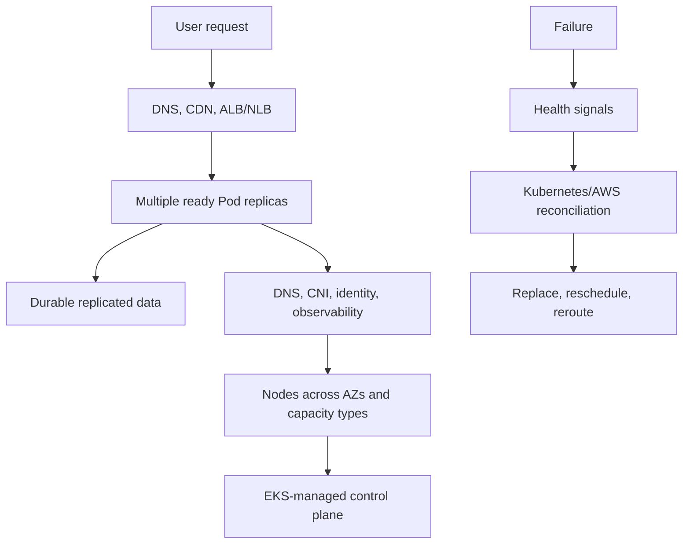
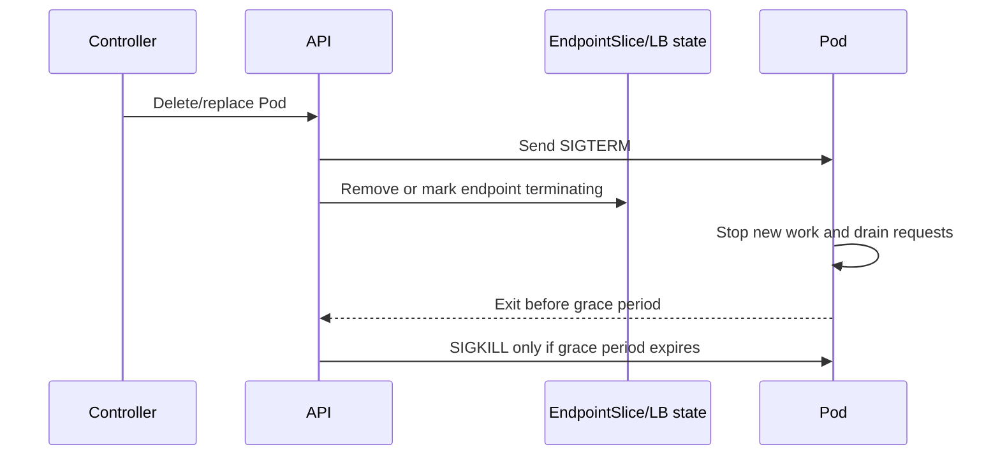
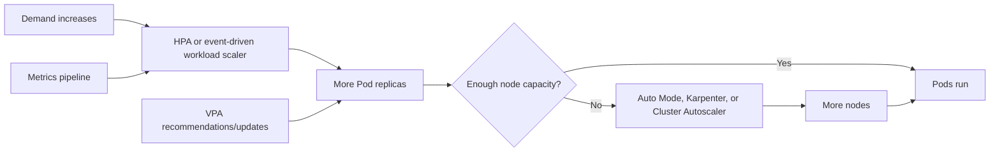

# 11. Reliability, autoscaling, and scalability

**Primary comparison sources:** [Reliability](https://docs.aws.amazon.com/eks/latest/best-practices/reliability.html), [Cluster autoscaling](https://docs.aws.amazon.com/eks/latest/best-practices/automode.html), and [Scalability](https://docs.aws.amazon.com/eks/latest/best-practices/scalability.html).

Reliability, scalability, and performance are related but different:

- **Reliability:** continue meeting requirements despite failures and change.
- **Scalability:** support increasing workload size and operational churn.
- **Performance:** meet latency/throughput objectives efficiently.

## 1. Reliability layers



Each layer needs independent failure detection and recovery.

## 2. Highly available applications

### Avoid singleton Pods

For a service that must survive maintenance or a node failure, run multiple replicas. Replicas should be distributed across nodes and Availability Zones.

Topology spread example:

```yaml
spec:
  topologySpreadConstraints:
    - maxSkew: 1
      topologyKey: topology.kubernetes.io/zone
      whenUnsatisfiable: DoNotSchedule
      labelSelector:
        matchLabels:
          app: web
    - maxSkew: 1
      topologyKey: kubernetes.io/hostname
      whenUnsatisfiable: ScheduleAnyway
      labelSelector:
        matchLabels:
          app: web
```

`DoNotSchedule` provides stronger distribution but can leave Pods pending when an AZ lacks capacity. `ScheduleAnyway` favors availability of a replica over strict balance. Choose consciously.

### PodDisruptionBudget

A PDB limits voluntary disruption, such as node consolidation or draining:

```yaml
apiVersion: policy/v1
kind: PodDisruptionBudget
metadata:
  name: web
spec:
  minAvailable: 2
  selector:
    matchLabels:
      app: web
```

A PDB does not:

- create replicas
- prevent involuntary node/AZ failure
- guarantee application readiness
- override an impossible scheduling configuration

Overly strict PDBs can block upgrades, rollback, consolidation, and security patching.

## 3. Probes and graceful lifecycle

- **Startup probe:** protects slow-starting applications from premature liveness failures.
- **Readiness probe:** controls whether a Pod receives Service/load-balancer traffic.
- **Liveness probe:** restarts a stuck process; poor liveness design can amplify outages.

Termination flow:



Applications must handle SIGTERM, stop accepting new work, finish or checkpoint in-flight work, and exit within `terminationGracePeriodSeconds`. Account for load-balancer and EndpointSlice propagation delay.

## 4. Safe rollouts

Use:

- readiness/startup probes
- appropriate `maxUnavailable` and `maxSurge`
- rollback-capable immutable image versions
- canary, blue/green, or progressive delivery for high-risk changes
- automated smoke tests and SLO checks
- deployment history limits

Database and API compatibility should permit old and new application versions to overlap during rollout.

## 5. Data-plane reliability

- Use subnets in multiple AZs.
- Ensure compute can actually launch in every intended AZ.
- Diversify instance types to reduce capacity risk.
- For EBS workloads, maintain compatible node capacity in the volume's AZ.
- Use requests and limits so scheduling reflects real needs.
- Use namespace quotas and LimitRanges to prevent uncontrolled consumption.
- Monitor node pressure, PID, disk, memory, and network saturation.
- Use Auto Mode health and replacement capabilities, while configuring disruption budgets intentionally.
- Keep critical platform components independent from volatile application capacity where needed.

The inspected workshop currently has all Pods on one node in one AZ. A multi-AZ control plane does not make a single-node data plane highly available.

## 6. Kubernetes QoS and resource sizing

QoS is derived from requests and limits:

- **Guaranteed:** CPU/memory requests equal limits for all containers.
- **Burstable:** at least one request/limit exists but Guaranteed criteria are not met.
- **BestEffort:** no CPU/memory requests or limits.

Under node pressure, lower-priority QoS workloads are generally more vulnerable to eviction. Reliability requires measured requests—not arbitrary large reservations.

Track both utilization and saturation:

```text
Low utilization + no saturation → possibly oversized
High utilization + no saturation → efficient
High utilization + throttling/latency/OOM → undersized or constrained
Low utilization + latency/queueing → inspect downstream/locks/I/O
```

## 7. Three scaling loops



### Workload horizontal scaling

HPA changes replica count using CPU, memory, custom, or external metrics. Ensure the metrics system is available and the target metric represents user demand.

Avoid scaling on a lagging metric without understanding stabilization windows. Fast scale-out and controlled scale-in are common patterns.

### Workload vertical scaling

VPA recommends or changes requests. It can improve bin packing but may restart Pods depending on mode and cannot replace horizontal scaling for throughput-oriented services.

### Node scaling

- **EKS Auto Mode:** integrated managed Karpenter-based compute.
- **Karpenter:** directly evaluates unschedulable Pod requirements and provisions fitting instances.
- **Cluster Autoscaler:** scales preconfigured node groups/Auto Scaling Groups.

Do not operate overlapping node scalers against the same capacity without a deliberate design.

## 8. Auto Mode and Karpenter practices

- Define realistic Pod requests.
- Permit multiple suitable EC2 instance types rather than one exact type.
- Separate NodePools only for genuine differences: architecture, accelerator, isolation, capacity type, taint, or disruption policy.
- Make overlapping NodePools mutually exclusive or intentionally weighted.
- Use Spot for interruption-tolerant workloads and On-Demand for required baseline where appropriate.
- Implement interruption handling and graceful workload disruption.
- Configure consolidation but protect disruption-sensitive workloads with balanced budgets—not permanent blocking.
- Use topology requirements that match actual subnet/AZ capacity.
- Avoid NodePools so restrictive that no instance can satisfy them.
- Monitor pending Pods, NodeClaims, launch failures, insufficient capacity, consolidation, and node churn.

For self-managed Karpenter, lock down AMI selection and place the controller on reliable capacity independent from the nodes it manages. Auto Mode manages its own integrated components and does not expose every self-managed Karpenter customization.

## 9. Cluster Autoscaler practices

For standard EKS node groups:

- use least-privilege IAM scoped to discoverable node groups
- keep instance shapes similar within a mixed-instance group
- reduce unnecessary numbers of node groups
- tune scan interval only after understanding responsiveness/API-cost trade-offs
- size the autoscaler for cluster scale
- use priority expanders when one node group should be preferred
- use overprovisioning only when lower scheduling latency justifies idle cost
- understand scale-from-zero labels/taints/resources
- monitor failed scale-up, unremovable nodes, and long-running scale-down blockers

## 10. Control-plane scalability

AWS scales the managed control plane, but clients determine load.

Reduce unnecessary API pressure:

- use watches/informers rather than repeated full lists
- use client-side caches
- apply exponential backoff and respect HTTP 429 responses
- avoid controllers that relist large resource sets frequently
- minimize expensive admission webhooks
- give webhooks short timeouts, high availability, and safe failure policy
- avoid large bursts of node/Pod creation and deletion
- limit unnecessary Kubernetes event and object churn
- use API Priority and Fairness to protect critical traffic

Monitor API request rate, latency, error codes, inflight requests, webhook latency, scheduler backlog, and etcd-related latency signals exposed by EKS.

## 11. Cluster-service scalability

CoreDNS, metrics pipelines, admission controllers, GitOps controllers, log agents, ingress, policy engines, and operators must scale with the cluster.

- horizontally scale CoreDNS when query demand rises
- reduce unnecessary external DNS queries and review `ndots` behavior
- scale Metrics Server and observability collectors
- avoid high-cardinality metric labels
- ensure platform Pods have requests, PDBs, topology distribution, and priority
- size webhook backends for burst events such as large rollouts

Managed control plane does not make customer-installed controllers automatically scalable.

## 12. Workload scalability

- Prefer EndpointSlices over legacy Endpoints behavior at scale.
- Limit unnecessary Services and environment-variable service links.
- Set `enableServiceLinks: false` unless required.
- limit Deployment revision history
- avoid one namespace containing an unbounded number of objects
- use immutable/external secrets where possible
- understand ELB, target, security-group, ENI, IP, EBS attachment, and AWS API quotas
- distribute workloads across clusters when isolation, regional resilience, or operational scale requires it

## 13. Scaling theory and bottlenecks

Every scaling path has upstream and downstream limits:

```text
Incoming demand
  → DNS/CDN/load balancer
  → application concurrency
  → Pod replicas
  → node capacity
  → network/IP capacity
  → data store/API quota
```

Adding Pods cannot fix a saturated database. Adding nodes cannot fix an AWS API quota. Larger nodes can reduce Kubernetes object/node churn but increase per-node blast radius. Smaller nodes reduce blast radius but increase daemon overhead and API load.

## 14. SLO-driven operation

Define user and platform SLOs, for example:

- request success and latency
- API-server request latency/error rate
- Pod startup latency
- scheduling latency
- DNS success/latency
- workload availability during node replacement

Use error budgets to decide whether to accelerate feature delivery or focus on reliability. Do not treat average latency as sufficient; inspect tail percentiles.

## 15. Quotas and preflight capacity

Track:

- EC2 On-Demand/Spot quotas by family
- ENIs and private IPs
- EBS volumes/attachments and API rate
- security-group rules
- ALBs/NLBs, target groups, targets, listeners
- NAT/VPC endpoint capacity and cost
- ECR/API throttling
- EKS/Kubernetes object and supported-scale guidance

Request quota increases before load testing or migration. A quota request is not a runtime scaling mechanism.

## 16. Reliability checklist

- [ ] Multiple replicas for critical services
- [ ] Replicas distributed across hosts and AZs
- [ ] PDBs tested against drain/upgrade behavior
- [ ] Correct startup/readiness/liveness probes
- [ ] Graceful SIGTERM and sufficient termination grace period
- [ ] Measured resource requests and quotas
- [ ] Multi-AZ compute capacity and diverse instance choices
- [ ] HPA/VPA/node-scaling loops tested independently and together
- [ ] Platform controllers scaled and protected
- [ ] API clients use watch/cache/backoff
- [ ] Service/AWS quotas monitored
- [ ] SLOs, error budgets, backups, and recovery tests defined
