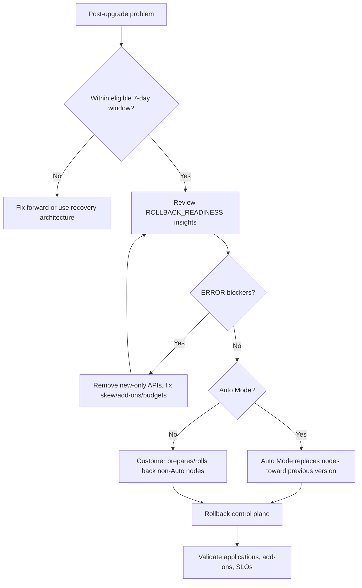

# 12. Cluster upgrades and version rollback

**Primary comparison sources:** [EKS cluster upgrade best practices](https://docs.aws.amazon.com/eks/latest/best-practices/cluster-upgrades.html) and [cluster version rollback best practices](https://docs.aws.amazon.com/eks/latest/best-practices/rollback-cluster-upgrades.html).

An EKS upgrade is a coordinated platform change, not only an API call. It affects the control plane, nodes, add-ons, controllers, CRDs, clients, webhooks, and workloads.

## 1. Version components

```text
Control-plane version: kube-apiserver and managed control components
Node version:          kubelet/runtime image on each node
Add-on versions:       CNI, DNS, proxy, CSI, ingress, observability
Client versions:       kubectl, SDK/client-go, CI tools
Workload APIs:         apiVersion fields and removed/deprecated behavior
```

EKS upgrades one Kubernetes minor version at a time. Plan sequential upgrades when several versions behind.

## 2. Support lifecycle

EKS Kubernetes versions move through standard support and then extended support. Extended support provides additional time but can cost more. At the end of the supported lifecycle, automatic upgrades can occur.

Treat extended support as temporary risk management. Maintain a release calendar, named upgrade owner, compatibility inventory, and recurring upgrade cadence.

## 3. Upgrade lifecycle


## 4. Before upgrading

### Review release information

- EKS version notes
- upstream Kubernetes changelog
- API deprecations/removals
- feature-gate behavior
- node OS/runtime changes
- add-on compatibility matrices
- third-party controller and Helm-chart support

### Inventory API consumers

Do not check only stored objects. Controllers, scripts, clients, and rarely executed jobs may call deprecated APIs.

Inventory:

- deployments, jobs, CronJobs, and manifests in Git
- CRDs and operators
- admission webhooks
- GitOps and CI/CD tools
- ingress/load-balancer controllers
- autoscalers
- storage/network drivers
- monitoring/security agents
- backup and policy tools

Static rendered manifests are often easier to assess accurately than only observing recent live API calls.

### Use EKS insights

Review `UPGRADE_READINESS` insights and remediate failures. Insights reduce effort but cannot validate custom business behavior or every self-managed controller.

### Check prerequisites

- sufficient free IPs in cluster subnets; EKS may require up to five during control-plane update
- cluster IAM role and trust still exist
- cluster role can use the KMS key when Secret encryption is enabled
- no unhealthy control-plane or critical platform condition
- PDBs and capacity permit node replacement
- backups and restore tests meet requirements

### Test outside production

Use a representative non-production cluster or automated compatibility environment. Test installation, normal traffic, scaling, disruption, storage, identity, policy, observability, and rollback—not only Pod startup.

## 5. Recommended sequence

1. Make the current data plane healthy and avoid beginning with excessive version skew.
2. Review source and target release notes.
3. Remediate deprecated APIs.
4. Select add-on versions compatible with both the current and target versions when possible.
5. Validate capacity, IAM, KMS, and backups.
6. Upgrade the EKS control plane by one minor version.
7. Observe a controlled bake period.
8. Upgrade add-ons and customer controllers in their documented order.
9. Upgrade `kubectl` and automation clients.
10. Upgrade or replace nodes.
11. Validate SLOs, logs, events, admission, DNS, network, identity, storage, and application behavior.
12. Record evidence and close the change.

## 6. Auto Mode behavior

After an Auto Mode control-plane upgrade, EKS incrementally updates managed nodes while respecting disruption controls. Operators should still monitor:

- node versions and replacement progress
- pending Pods
- NodePool disruption budgets
- application PDBs
- topology/capacity constraints
- EBS AZ placement
- SLO and error-budget impact

A zero NodePool disruption budget or `karpenter.sh/do-not-disrupt` can prevent required replacement, including rollback progression.

## 7. Standard EKS data planes

### Managed node groups

Initiate node-group upgrades after the control plane and compatible add-ons. Configure update strategy and maximum unavailable capacity to preserve workload availability.

### Self-managed nodes

Prefer immutable replacement: create updated capacity, validate registration, cordon/drain old nodes, and remove old infrastructure through IaC.

### Fargate

Replace Fargate Pods so they are recreated against the appropriate platform version. Include this in the upgrade inventory rather than assuming the control-plane update changes existing Pods immediately.

### Self-managed Karpenter/Cluster Autoscaler

Validate controller compatibility with the target Kubernetes version. Cluster Autoscaler is tightly coupled to Kubernetes minor versions. Validate Karpenter CRDs, controller version, AMI selection, and disruption behavior.

## 8. Add-on upgrade inventory

Common components include:

- Amazon VPC CNI
- CoreDNS
- kube-proxy
- EBS/EFS CSI
- AWS Load Balancer Controller
- Metrics Server
- Cluster Autoscaler or Karpenter
- ADOT and logging agents
- policy/admission engines
- GitOps controllers
- service mesh

EKS managed add-ons are not automatically upgraded merely because the control plane was upgraded. Auto Mode integrated capabilities are managed differently and should not be treated like visible self-managed add-on Deployments.

## 9. Rollback capability

Current EKS guidance describes control-plane rollback to the previous minor version within seven days of an in-place upgrade, subject to eligibility and readiness requirements.

Rollback is a safety net, not a replacement for testing.



## 10. Shared responsibility during rollback

EKS manages the control-plane rollback. For Auto Mode, EKS also manages the corresponding managed-node rollback process.

Customers remain responsible for:

- managed node groups, self-managed nodes, and hybrid nodes as applicable
- Fargate compatibility constraints
- self-managed add-ons and controllers
- application and API compatibility
- disruption budgets
- rollback testing and validation
- IaC state/configuration alignment

## 11. Keep rollback possible during the bake period

- Keep non-Auto Mode nodes at a version compatible with both sides until confidence is established.
- Select add-on versions that are cross-compatible when possible.
- Avoid immediately using APIs/features available only in the new version.
- Review `ROLLBACK_READINESS` insights immediately after upgrade.
- Address errors early rather than waiting for an incident.
- Maintain old application image/config versions and compatible database schemas.

An automatic upgrade after the end of extended support has rollback restrictions; do not depend on rollback as justification for ignoring the lifecycle calendar.

## 12. Auto Mode rollback disruption controls

Node replacement can dominate rollback duration. Review:

- NodePool disruption budgets
- application PDBs
- `do-not-disrupt` annotations
- spare capacity and topology constraints
- rollback timeout

A budget of zero can block progress indefinitely. If budgets are loosened during an incident, record and restore intentional settings afterward.

Monitor the EKS update operation, node Kubernetes versions, workload health, and insights. Cluster status alone may not reveal every phase of an Auto Mode rollback.

## 13. Infrastructure as Code (IaC) considerations

Long-running rollback can exceed IaC operation timeouts and create apparent drift. Keep these principles:

- Terraform/CloudFormation desired version must match the intended final cluster state.
- Tool timeout does not necessarily mean EKS stopped processing.
- Monitor the EKS update operation directly.
- Avoid launching a competing update while one is active.
- Reconcile state/configuration after completion or cancellation.
- Understand that a generic CloudFormation stack rollback does not automatically invoke the EKS Kubernetes version rollback workflow.

Do not manipulate Terraform state merely to hide a failed operation. Back up state and understand actual AWS state first.

## 14. Rollback versus blue/green

In-place upgrade plus rollback preserves cluster identity, endpoint, OIDC provider, ENIs, and attached ecosystem resources while avoiding duplicate-cluster cost.

Blue/green can still be preferable when:

- moving across several versions
- changing major networking/security architecture
- extensive isolated migration testing is required
- full traffic isolation is needed
- cluster-level rollback is not sufficient for data/application changes

Blue/green introduces identity, DNS, data migration, observability, and duplicate-cost complexity.

## 15. Validation matrix

After upgrade or rollback, validate:

| Layer | Checks |
|---|---|
| Control plane | API latency/errors, audit/authenticator logs, insights |
| Access | human access, CI role, RBAC, Pod Identity/IRSA |
| Platform | DNS, networking, storage, ingress, autoscaling, admission |
| Nodes | versions, readiness, zones, pressure, replacement progress |
| Workloads | readiness, error rate, latency, queue depth, scheduled jobs |
| Data | mounts, writes, backup/restore, schema compatibility |
| Exposure | ALB/NLB target health, DNS, TLS, WAF |
| Operations | dashboards, alerts, logs, tracing, runbooks |

## 16. Upgrade checklist

- [ ] Owner, target version, window, and rollback decision point defined
- [ ] Release/deprecation notes reviewed
- [ ] Upgrade Readiness Insights passing or accepted
- [ ] Static and live API usage checked
- [ ] Add-on/controller compatibility recorded
- [ ] Free subnet IP, IAM, and KMS prerequisites verified
- [ ] Non-production test passed
- [ ] Backups and restore paths validated
- [ ] PDB/topology/capacity permit disruption
- [ ] Control plane upgraded one minor version
- [ ] Bake period observed before adopting new-only APIs
- [ ] Add-ons, clients, and nodes upgraded
- [ ] Rollback Readiness Insights reviewed within seven-day window
- [ ] Application and SLO validation passed
- [ ] IaC desired state and documentation updated
