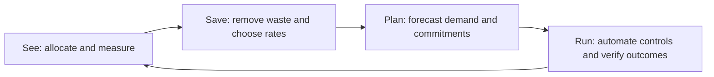
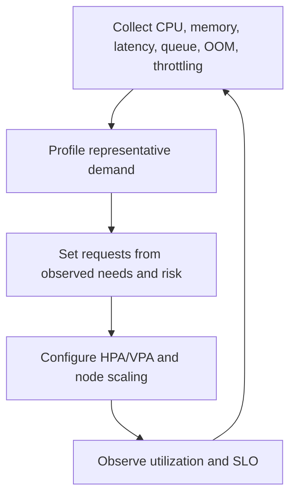

# 13. Cost and performance efficiency

**Primary comparison source:** [AWS EKS cost optimization best practices](https://docs.aws.amazon.com/eks/latest/best-practices/cost-opt.html).

Cost optimization means meeting business and reliability outcomes at the lowest sustainable cost—not simply minimizing the bill. Removing redundancy or monitoring can make a system cheaper and less valuable.

## 1. Continuous optimization loop



Repeat continuously because workloads, prices, instance availability, and product requirements change.

## 2. Establish expenditure awareness

Before optimizing, make costs attributable.

- Use consistent account, cluster, application, environment, owner, and cost-center tags.
- Enable AWS cost allocation tags.
- Use Cost Explorer and cost/usage reports.
- Evaluate Split Cost Allocation Data for shared EKS compute.
- Combine AWS billing data with Kubernetes requests, usage, namespace, and labels.
- Use Container Insights, Prometheus, Kubecost, or another approved allocation platform.
- Assign owners and budgets to shared services such as NAT, load balancers, logging, and observability.
- Alert on trend/anomaly changes rather than waiting for the invoice.

A cluster-level bill is insufficient for chargeback when many teams share nodes.

## 3. Cost equation

```text
Total cost = cluster/support tier
           + Auto Mode/capability charges
           + compute
           + storage and backup
           + load balancing/network transfer/NAT/IPv4
           + images
           + logs/metrics/traces
           + application AWS services
           + engineering and incident cost
```

A cheaper infrastructure design that creates frequent incidents can have higher total cost.

## 4. Right-size workloads first

Node efficiency starts with Pod requests.



- Set requests for every workload.
- Do not copy limits into requests without measurement.
- Watch CPU throttling, OOM kills, memory working set, queue depth, and tail latency.
- Use VPA recommendations where appropriate.
- Use HPA for demand-driven replica scaling.
- Remove completed Jobs and abandoned test workloads.
- Schedule non-production scale-down only when acceptable and automated recovery is tested.

Large requests create stranded capacity. Tiny requests create saturation and unstable bin packing.

## 5. Reduce unused node capacity

- Enable Auto Mode/Karpenter consolidation where disruption permits.
- Ensure PDBs and `do-not-disrupt` settings do not permanently block optimization.
- Allow enough instance diversity to find capacity and efficient shapes.
- Separate specialized GPU/accelerator pools from normal workloads.
- Use taints only where isolation is required; excessive pools fragment capacity.
- Monitor requested versus allocatable resources, not only EC2 utilization.
- Account for DaemonSet overhead when selecting node size.

Larger nodes reduce daemon/API overhead but increase failure blast radius. Smaller nodes improve granularity but may cost more in overhead.

## 6. Purchasing models

### On-Demand

Use for unpredictable, interruption-sensitive, or baseline capacity.

### Spot

Use for workloads that tolerate interruption:

- stateless replicas
- fault-tolerant workers
- checkpointed batch/training
- flexible queues

Diversify instance types and AZs, handle interruption signals, and maintain sufficient non-Spot baseline where required.

### Savings Plans and commitments

Use for predictable eligible compute after measuring a stable baseline. Do not commit based on temporary peak usage or oversized requests.

A common strategy is:

```text
Stable baseline → Savings Plan/committed usage
Variable resilient demand → Spot
Uncertain or critical burst → On-Demand
```

## 7. Network cost

Network architecture can dominate at scale.

### Cross-AZ traffic

Topology-aware routing and same-zone affinity can reduce cross-AZ transfer, but strict locality can reduce resilience or overload one zone. Optimize only after measuring and retaining failover.

### Load balancer targets

IP targets route directly to Pods and can avoid an extra NodePort hop. Validate health, readiness, and target-registration behavior.

### NAT Gateways

Private workloads often reach internet/AWS public endpoints through NAT. Reduce unnecessary NAT processing using approved VPC endpoints for high-volume AWS services, while accounting for endpoint hourly/data charges and policy management.

### Container images

Use ECR in the same Region, reduce image size, clean unused layers/tags, and consider ECR VPC endpoints for private paths. Avoid excessive image pulls caused by mutable tags or node churn.

### Inter-VPC and internet transfer

Review peering, Transit Gateway, VPC Lattice/service mesh, and public paths. Architecture should minimize unnecessary hops without creating fragile coupling.

## 8. Storage cost

### EBS

- Prefer GP3 over older general-purpose types when appropriate.
- Size capacity, IOPS, and throughput independently from actual demand.
- Monitor unattached volumes and stale snapshots.
- Define snapshot retention and lifecycle policy.
- Expand deliberately; EBS/PVC shrinking is not generally a simple inverse operation.
- Consider instance-store ephemeral volumes only for reproducible/cache data.

### EFS

Choose performance/throughput and lifecycle/storage classes based on access patterns. Shared convenience can conceal inactive-data cost.

### FSx

Choose deployment and capacity for the workload. Link to S3 where supported and beneficial for data lifecycle.

### Backups

Retention must follow business recovery requirements. “Delete all old snapshots” is not optimization if it violates recovery objectives.

## 9. Observability cost

Observability is essential but unbounded telemetry is expensive.

- Set log retention by environment and compliance need.
- Reduce debug verbosity outside controlled windows.
- Filter at the source when data has no operational/audit value.
- Archive long-term logs to an appropriate storage tier.
- Avoid high-cardinality metric labels such as request IDs, user IDs, and unbounded URLs.
- Control scrape frequency and histogram buckets.
- Define trace sampling strategies.
- Monitor ingestion, query, and retention cost by team.
- Keep audit/security evidence according to policy even if it is expensive.

Do not disable signals blindly. First identify consumers, incident value, compliance, and replacement evidence.

## 10. Control-plane and version cost

- Consolidate clusters only when tenant, blast-radius, region, and upgrade requirements permit.
- Avoid a cluster per small workload by default.
- Avoid oversized shared clusters when independent failure/upgrade boundaries are required.
- Stay in standard Kubernetes version support to avoid extended-support cost and operational risk.
- Delete abandoned clusters only after owner, data, DNS, IAM, and recovery review.

## 11. Cost-aware availability

Cost controls should preserve:

- minimum replicas
- AZ failure tolerance
- backup/restore objectives
- security monitoring
- safe upgrade capacity
- sufficient surge capacity

Maintain a written list of non-negotiable reliability/security constraints so automated optimization cannot violate them.

## 12. Optimization checklist

- [ ] Costs allocated to application/team/environment
- [ ] Requests and limits based on measured behavior
- [ ] HPA/VPA/node scaling tuned together
- [ ] Consolidation blockers reviewed
- [ ] Instance diversity and purchase model intentional
- [ ] Commitments based on stable baseline
- [ ] NAT, cross-AZ, ELB, and public IPv4 cost measured
- [ ] ECR and image-pull behavior optimized
- [ ] Volumes/snapshots and storage classes reviewed
- [ ] Log retention, metric cardinality, and trace sampling controlled
- [ ] Kubernetes versions remain in standard support
- [ ] Every saving validated against SLO, security, and recovery requirements
