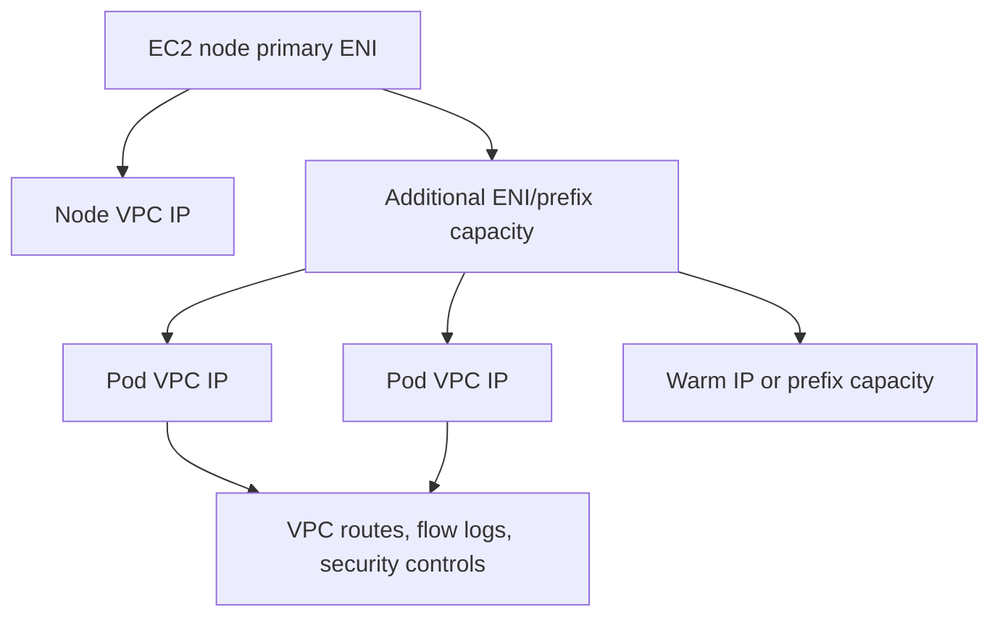
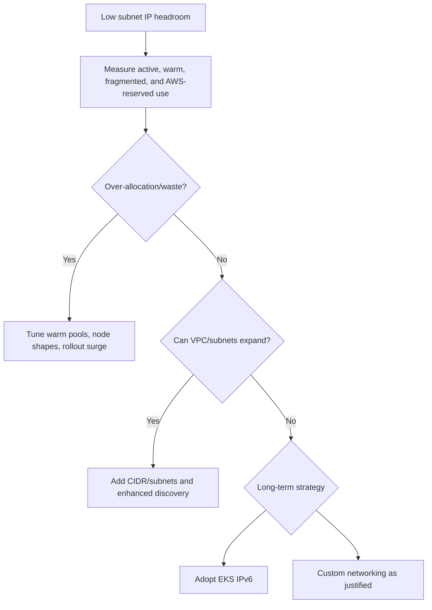
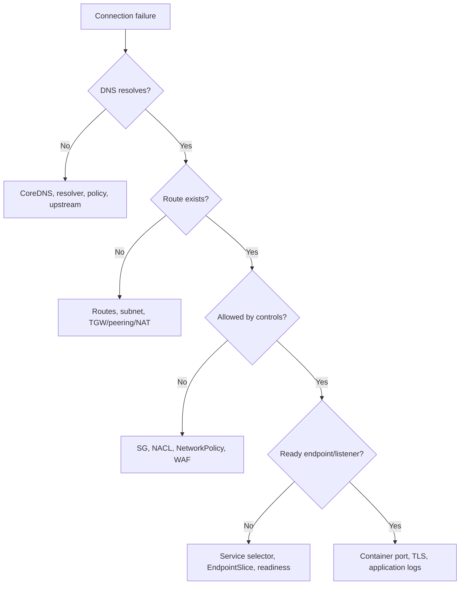

# 14. Advanced networking and IP planning

**Primary comparison source:** [AWS EKS networking best practices](https://docs.aws.amazon.com/eks/latest/best-practices/networking.html).

The fundamentals chapter explains packet flow. This chapter addresses scaling and operating the network: IP capacity, CNI modes, subnet design, IPv6, security groups, and performance diagnosis.

## 1. Kubernetes networking contract

The model expects:

- every Pod can communicate with other Pods without application-managed NAT
- node system processes can reach local Pods
- host-network Pods can reach normal Pods
- a Pod IP identifies the Pod consistently within the cluster network

The CNI creates/deletes Pod interfaces and assigns network resources. Services, kube-proxy or equivalent data-plane behavior, DNS, ingress, and policy are related but distinct components.

## 2. VPC CNI mental model



Traditional VPC CNI uses `ipamd` and CNI binaries on nodes to manage ENIs and addresses. EKS Auto Mode integrates networking as a managed node capability; do not assume every self-managed VPC CNI environment variable or DaemonSet procedure applies to Auto Mode.

## 3. Capacity planning

Estimate addresses for:

- nodes
- active Pods
- warm IPs/prefixes
- rolling deployments
- HPA and node scale-out bursts
- load balancers and VPC endpoints
- EKS control-plane requester-managed ENIs
- failure/maintenance headroom

```text
Required capacity ≠ current Pod count
Required capacity = steady state + rollout surge + scale burst
                  + warm pool + failure headroom + AWS resources
```

Monitor `AvailableIpAddressCount`, CNI/Auto Mode networking metrics, pending Pods, ENI limits, and subnet fragmentation.

## 4. Secondary-IP mode

In traditional secondary-IP mode, Pod density is constrained by:

- maximum ENIs per instance
- IPv4 addresses per ENI
- addresses reserved for the node/network
- configured warm targets

It is straightforward for smaller clusters but can consume IPv4 space quickly.

## 5. Prefix delegation

Prefix mode assigns IPv4 prefixes to ENIs so addresses are available in blocks. Benefits can include faster Pod address allocation and greater density.

Practices:

- use sufficiently large, unfragmented subnets
- consider subnet CIDR reservations to preserve contiguous prefixes
- prefer allocating a prefix before attaching more ENIs when appropriate
- tune warm-prefix/IP targets based on startup needs versus address waste
- use similar instance types within a node group for predictable density
- replace nodes during mode transitions
- avoid unsupported VPC CNI downgrades

This guidance primarily applies to standard/self-managed VPC CNI operation; Auto Mode manages integrated address behavior through its supported NodeClass/networking interfaces.

## 6. IPv4 exhaustion response



Do not wait until a subnet is nearly exhausted. Node scale-out and control-plane upgrades need free addresses.

## 7. IPv6

AWS guidance favors IPv6 as a long-term answer when IPv4 address exhaustion is fundamental.

Consider:

- organizational IPv6 routing, firewall, DNS, and observability readiness
- how IPv6 Pods reach IPv4-only dependencies
- ingress/load-balancer compatibility
- Fargate and add-on behavior
- security controls for both address families
- application libraries and hardcoded IPv4 assumptions

An EKS IPv6 cluster generally gives Pods IPv6 addresses; it is not simply an automatic dual-stack conversion of every dependency. Test end-to-end.

## 8. Custom networking

Custom networking can allocate Pod IPs from different subnets/CIDRs than node primary interfaces. It can preserve primary RFC1918 ranges or separate Pod and node networks/security groups.

Use it when a concrete requirement justifies the complexity. Account for:

- per-AZ subnet mappings
- reduced Pod density in some configurations
- route/firewall visibility
- CGNAT CIDR conflicts
- Pod replacement during migration
- max-Pod calculations
- operational troubleshooting

Avoid choosing custom networking merely because IPv4 planning was postponed if IPv6 or VPC expansion is the better long-term design.

Auto Mode NodeClass can select node and, where supported, separate Pod subnets/security groups through its own managed model.

## 9. Enhanced subnet discovery

Where supported, subnet discovery can allow new tagged subnets to contribute address capacity without replacing every node configuration manually. Treat tags as infrastructure controls:

- manage them through IaC
- prevent accidental selection of wrong route/security domains
- monitor per-subnet free capacity
- confirm AZ coverage

For load balancers, use the required public/internal subnet role tags described in `06-load-balancing.md`.

## 10. Security Groups for Pods

Security Groups for Pods can apply VPC security controls to selected workloads.

Use when:

- existing AWS resources authorize by security group
- Pod-level VPC segmentation is required
- policy ownership aligns with VPC security operations

Check compatibility with instance types, CNIs, network policy, source NAT, probes, NodeLocal DNS, load balancers, and enforcement modes. Place security-group-enabled Pods in private subnets and test termination behavior.

NetworkPolicy is usually better for Kubernetes selector-based east-west policy; Security Groups for Pods are strong for VPC/AWS-resource boundaries. They can be complementary.

## 11. Service traffic policy and topology

- `externalTrafficPolicy: Local` can preserve source IP and avoid cross-node hops but requires healthy local endpoints on traffic-receiving nodes.
- `internalTrafficPolicy` and topology-aware routing can improve locality.
- same-zone/same-node routing can reduce latency and transfer cost.

Locality must have a fallback strategy. Strict locality can overload a zone or cause dropped traffic during uneven scaling.

## 12. Load-balancer lifecycle

Account for asynchronous state propagation:

```text
Pod readiness changes
  → EndpointSlice update
  → controller reconciliation
  → target registration/deregistration
  → target health checks
  → traffic decision
```

Use readiness probes, graceful termination, sufficient grace periods, and load-balancer readiness mechanisms where applicable. Do not terminate a Pod before upstream systems stop routing new connections.

## 13. DNS and conntrack

Symptoms such as intermittent lookup failure or delay can result from:

- CoreDNS/node-local DNS saturation
- excessive search-domain/`ndots` queries
- upstream resolver throttling
- conntrack table pressure
- packet loss or ENI bandwidth saturation

Monitor DNS request rate, errors, latency, cache behavior, conntrack usage/drops, ENI packet allowances, retransmits, and application resolver behavior.

## 14. nftables mode

Newer Kubernetes environments can use kube-proxy nftables mode where supported. It can improve scaling characteristics compared with large iptables rule sets. Verify Kubernetes version, kernel/node OS, CNI, monitoring, and operational tooling support before changing modes.

Auto Mode may provide managed network proxy behavior rather than a user-managed kube-proxy DaemonSet, so standard migration commands may not apply.

## 15. Private-cluster AWS access

A fully private cluster may require VPC endpoints for services used by nodes and workloads, potentially including:

- ECR API and Docker registry
- S3 for image layers and application data paths
- STS
- EKS-related APIs
- CloudWatch Logs/Monitoring
- SSM and KMS

The exact set depends on architecture. Apply endpoint policies and private DNS carefully. Pod Identity also requires its documented private connectivity path.

## 16. Network troubleshooting flow



## 17. Network checklist

- [ ] Subnet/IP model includes surge and failure headroom
- [ ] Multiple AZs and correct route domains
- [ ] Auto Mode versus standard CNI operating model documented
- [ ] Prefix delegation/custom networking used only when justified
- [ ] IPv6 roadmap assessed
- [ ] Public/internal load-balancer subnet tags managed by IaC
- [ ] NetworkPolicy and security-group responsibilities explicit
- [ ] DNS, conntrack, ENI, packet-drop, and IP metrics monitored
- [ ] Graceful termination accounts for target-state propagation
- [ ] Private clusters have required VPC endpoints and endpoint policies
