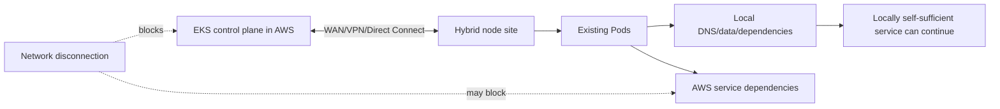
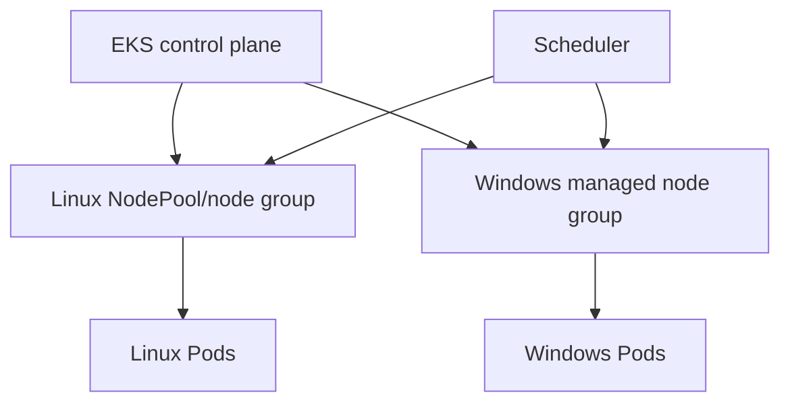
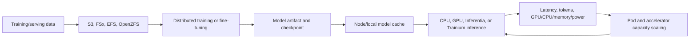

# 15. Specialized workloads: Hybrid, Windows, and AI/ML

**Primary comparison sources:** [Hybrid deployments](https://docs.aws.amazon.com/eks/latest/best-practices/hybrid.html), [Windows](https://docs.aws.amazon.com/eks/latest/best-practices/windows.html), and [AI/ML](https://docs.aws.amazon.com/eks/latest/best-practices/aiml.html).

These domains are not required for every cluster, but omitting them from an EKS curriculum hides major design differences.

# Part A — Hybrid deployments

## 1. Hybrid failure model

Hybrid Nodes depend on connectivity to the AWS-hosted EKS control plane. Existing containers may continue running during a network partition, but Kubernetes control loops, scheduling, status, configuration changes, cloud API calls, and remote dependencies can be degraded or unavailable.



Do not assume “Pod still running” means “application healthy.” Authentication, DNS, queues, databases, certificates, image pulls, telemetry, and external APIs may still be remote.

## 2. Hybrid resilience practices

- Use redundant network paths/providers/devices.
- Monitor latency, packet loss, BGP/tunnel state, DNS, and control-plane reachability.
- Provide local troubleshooting access that does not depend on the failed WAN.
- Run multiple application replicas across appropriate local failure domains.
- Identify every remote AWS/service dependency.
- Cache or replicate required data locally where consistency requirements permit.
- Ensure local DNS and service routing survive the intended disconnection scenario.
- Pre-pull critical images because new Pods may not reach registries.
- Design credentials that remain valid and available for the expected partition duration.
- Tune Pod/node failure detection only after understanding false failover and split-brain risk.

## 3. Pod failover during partitions

Kubernetes decisions depend on what the control plane can observe. A disconnected node may appear unhealthy while its Pods continue serving locally. Rescheduling duplicates elsewhere can cause split-brain for stateful workloads.

Evaluate scenarios:

- full cluster/site disconnection
- entire zone/site failure
- majority versus minority partition
- node restart during disconnection
- control plane reachable but application WAN dependency unavailable

For each, document who serves traffic, whether duplicate instances are safe, data consistency, fencing, and recovery reconciliation.

## 4. Hybrid identity

Host management may use mechanisms such as SSM hybrid activations or IAM Roles Anywhere depending on design. Workload credentials and host credentials are separate concerns. Expiration, rotation, revocation, and offline duration must be explicitly designed.

# Part B — Windows workloads

## 5. Heterogeneous cluster model

Windows containers require Windows nodes. Linux and Windows workloads can share a Kubernetes control plane but not a kernel.



Schedule explicitly:

```yaml
spec:
  nodeSelector:
    kubernetes.io/os: windows
```

Use taints/tolerations or RuntimeClass where useful. If several Windows build versions coexist, constrain Pods to compatible nodes.

## 6. Windows lifecycle

- Select a supported Windows Server LTSC/base-image version.
- Keep host and container image compatibility aligned.
- Patch nodes and rebuild application images regularly.
- Prefer immutable node replacement over manual patch drift.
- Use optimized/custom AMIs only with a maintained build pipeline.
- Cache large Windows base layers carefully to reduce launch/pull time.
- Account for Windows licensing cost.

## 7. Windows security

- Prefer Server Core to reduce attack surface where compatible.
- Avoid routine RDP access; use controlled remote-management paths.
- Use non-administrator identities where application support permits.
- Apply Windows-compatible Pod/container security controls.
- Use Inspector, GuardDuty, image scanning, logging, and endpoint protection as supported.
- Harden IIS and local account/audit policy for the actual application model.
- Do not assume Linux seccomp/capability controls translate directly to Windows.

## 8. Windows identity and gMSA

Group Managed Service Accounts support Windows-integrated domain authentication. Designs can use domain-joined or supported domainless patterns. Protect credential specifications and constrain who can reference them.

## 9. Windows networking, memory, and storage

- Plan additional VPC IP consumption and supported CNI mode.
- Validate NetworkPolicy implementation for Windows.
- Reserve memory for Windows, kubelet, and system services.
- Size container memory to avoid host and Pod OOM conditions.
- Use supported CSI drivers; FSx for Windows File Server is relevant for SMB/shared Windows storage.
- Monitor Windows-specific performance counters and event logs.

# Part C — AI/ML workloads

## 10. AI/ML lifecycle



AI workloads amplify compute scarcity, startup time, network bandwidth, storage throughput, scheduling, and observability requirements.

## 11. Accelerator scheduling

- Request accelerators through Kubernetes resources/device plugins or Auto Mode integrated support.
- Use well-known labels/resources rather than hardcoding one instance where possible.
- Permit several compatible accelerator instance types when framework/model requirements allow.
- Separate training and serving NodePools when their disruption/latency needs differ.
- Protect system/platform workloads from expensive accelerator nodes using taints/tolerations.
- Monitor allocatable versus used accelerator capacity.

## 12. Capacity strategy

Options include:

- On-Demand for flexible critical demand
- Spot for interruption-tolerant training/batch with checkpoints
- On-Demand Capacity Reservations
- Capacity Blocks for supported high-demand accelerators
- diversified G/P/Trainium/Inferentia instance choices

Capacity assurance is often more important than nominal hourly price. A training job unable to acquire all workers wastes reserved partial capacity.

## 13. Checkpointing and disruption

Long-running training must checkpoint frequently enough to meet recovery objectives. Store checkpoints durably outside node-local storage.

- handle Spot interruption and node replacement
- choose checkpoint interval using write cost versus recomputation cost
- validate restore, not only checkpoint creation
- avoid consolidation for jobs that cannot tolerate movement
- clean completed Jobs using `ttlSecondsAfterFinished`
- use gang scheduling/queueing where all workers must start together

## 14. GPU sharing

Improve utilization with supported mechanisms:

- time slicing
- Multi-Instance GPU (MIG)
- fractional allocation solutions

Isolation, performance predictability, memory limits, failure blast radius, and framework support differ. Benchmark with representative models before sharing production accelerators.

## 15. CPU inference

CPU can be appropriate for:

- small or quantized models
- low/medium throughput
- preprocessing and routing
- agentic pipelines that call external models
- model farms where accelerator economics are unfavorable

Decision inputs are measured latency, throughput, model size, batch behavior, availability, engineering complexity, and cost—not an assumption that all inference requires GPUs.

## 16. AI networking

Distributed training can require high inter-node bandwidth and low latency. Consider Elastic Fabric Adapter and compatible placement when frameworks benefit.

- co-located EFA capacity constrains scheduling
- Spot interruption can disrupt the entire distributed job
- large accelerator nodes can consume many Pod IPs
- image/model downloads can saturate network paths
- cross-AZ distributed training may add latency and transfer cost

## 17. Model and data storage

- S3 for durable object datasets/artifacts
- S3 Express One Zone where its latency/availability model fits
- FSx for Lustre for high-throughput parallel data access
- EFS/OpenZFS for suitable shared filesystem/cache patterns
- EBS/NVMe for node-local cache and high-speed scratch, with explicit durability semantics
- CSI-based model delivery where supported

Separate authoritative artifact storage from disposable local caches. Secure datasets/models with IAM, KMS, network controls, and provenance checks.

## 18. Startup performance

Model servers may spend minutes pulling images and artifacts.

Optimize:

- smaller container images and layers
- artifact/image locality
- lazy loading/SOCI where supported
- EBS snapshot or prewarming patterns
- node/container-runtime caches
- parallel downloads bounded by network/storage
- startup probes sized for real initialization time
- minimum warm replicas for latency-sensitive serving

Do not use liveness probes that repeatedly kill a healthy but slow-loading model.

## 19. AI/ML observability

Monitor:

- accelerator utilization, memory, temperature, power, and errors
- training loss, learning rate, throughput, checkpoint time
- data-loader and storage throughput
- collective communication/network performance
- inference request latency and errors
- time to first token, inter-token latency, and tokens/second
- queue depth, batch size, cache hit rate
- model quality/drift signals appropriate to the application
- cost per training run or inference unit

Low GPU utilization can be caused by data, network, CPU preprocessing, batching, or synchronization—not necessarily lack of requests.

## 20. Specialized-workload checklist

### Hybrid

- [ ] Redundant control-plane/WAN connectivity
- [ ] Local operation during partition explicitly defined
- [ ] Remote dependencies inventoried
- [ ] Split-brain/failover behavior tested
- [ ] Offline credential and troubleshooting path designed

### Windows

- [ ] OS/build-compatible node placement
- [ ] Immutable AMI/image patch pipeline
- [ ] No routine RDP dependency
- [ ] Windows memory/network/storage behavior tested
- [ ] gMSA and credential specs protected if used

### AI/ML

- [ ] Accelerator/CPU choice benchmarked
- [ ] Capacity acquisition strategy defined
- [ ] Checkpoint/restore tested
- [ ] Model/data storage and cache tiers explicit
- [ ] Startup and probe behavior measured
- [ ] AI-specific throughput, latency, quality, and cost monitored
