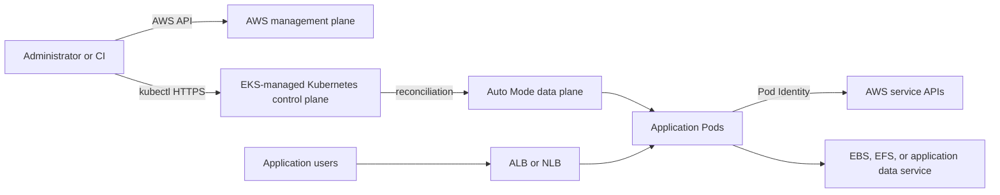

# Amazon EKS Deep Dive

A practical, diagram-driven guide to Amazon EKS, based on read-only inspection of an EKS Auto Mode workshop cluster.

## Goals

This guide explains how AWS and Kubernetes components cooperate from the moment an administrator runs `kubectl` until an application Pod is running, calling AWS APIs, mounting storage, and receiving traffic through an AWS load balancer.

## Learning path

1. [EKS architecture and reconciliation](01-architecture.md)
2. [`kubectl`, authentication, access entries, and RBAC](02-kubectl-access.md)
3. [VPC, node, Pod, Service, and DNS networking](03-networking.md)
4. [EKS Pod Identity](04-pod-identity.md)
5. [Kubernetes storage and Amazon EBS](05-storage.md)
6. [Exposing applications with ALB and NLB](06-load-balancing.md)
7. [Sanitized live-environment audit](07-live-environment-audit.md)
8. [Hands-on labs and validation commands](08-hands-on-labs.md)
9. [What is Amazon EKS? — complete AWS page explained](09-what-is-amazon-eks.md)
10. [Production security and governance](10-production-security.md)
11. [Reliability, autoscaling, and scalability](11-reliability-autoscaling-scalability.md)
12. [Cluster upgrades and version rollback](12-upgrades-and-rollback.md)
13. [Cost and performance efficiency](13-cost-and-performance-efficiency.md)
14. [Advanced networking and IP planning](14-advanced-networking.md)
15. [Specialized workloads: Hybrid, Windows, and AI/ML](15-specialized-workloads.md)
16. [References](REFERENCES.md)

Standalone Mermaid sources are under [`diagrams/`](diagrams/). A reusable read-only discovery script is under [`scripts/`](scripts/).

## Core mental model

## Repository safety

This documentation intentionally excludes:

- AWS account IDs and access-key identifiers
- IAM role ARNs and assumed-role session names
- cluster endpoint URLs and certificate data
- VPC, subnet, security-group, instance, node, and volume IDs
- Secret values, passwords, tokens, and application credentials

All executable examples use environment variables such as `$AWS_REGION` and `$CLUSTER_NAME`. Never commit Terraform state, kubeconfig files, credentials, generated tokens, or unredacted command output.

## Operational status

The discovery described in this guide was read-only. No cluster, network, application, IAM, storage, or load-balancer resource was changed. Infrastructure mutations must be reviewed through Terraform plan before apply.

## GitHub portfolio organization

See [`github/README.md`](github/README.md) for the proposed EKS/container repository catalog, topic taxonomy, safe application workflow, and issue template.
